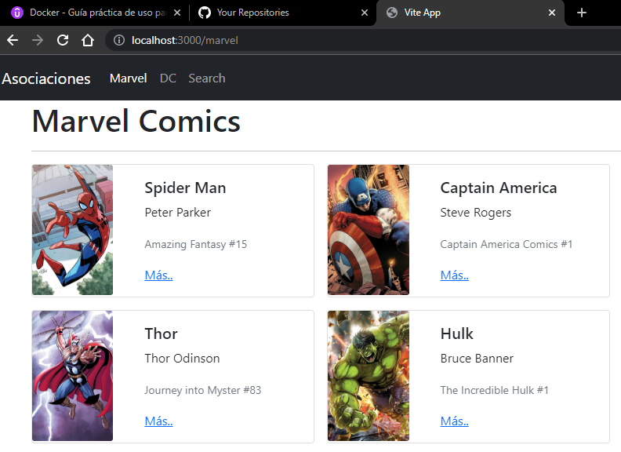
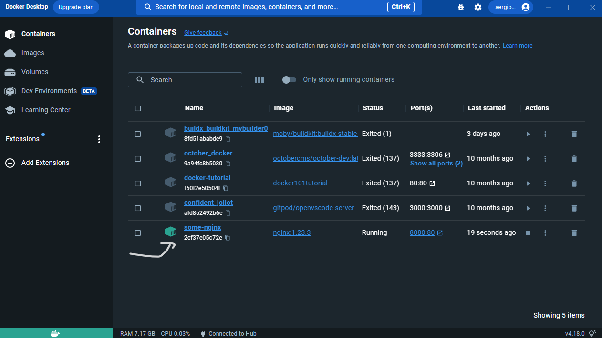
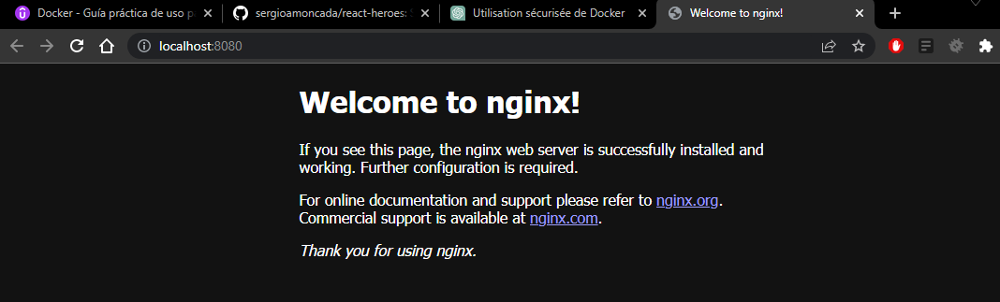
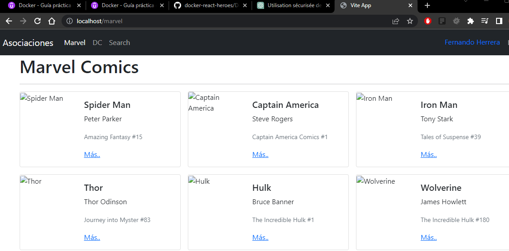
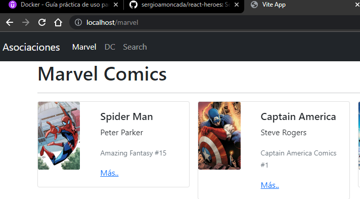

## melos config :

- Installation de **very_good_cli** :

```
dart pub global activate very_good_cli
```

- Créer un projet dart avec **very_good_cli.**

```
very_good create <your_project_dart> -t dart_pkg
```

- Créer un projet flutter avec **very_good_cli.**

```
very_good create <your_project_flutter> -t flutter_pkg
```

---

- Installer **melos** globalement sur le pc.

```
dart pub global activate melos
```

- Voir ce qu'il y a dans un dossier :

```
shell > ls
```

- Créer un dossier :

```
shell > mkdir <exemple_packages>
```

- Construire le projet melos - avec les autres packages :
  > melos bs : est comme faire cd à un dossier et après faire dart pub get, dossier par dossier !

```
shell - melos >

melos bs
```

- Si nous voulons lancer les tests sur nos application à partir de melos.

À l'intérieur du **pubspec.yaml** de melos on doit ajouter ces **_scripts:_** et par la suite executer les commande sur le terminal voir plus bas.

- [pubspec.yaml](pubspec.yaml)

```
name: melos
packages:
  - packages/**

command:
  bootstrap:
    usePubspecOverrides: true

scripts:
  test:
    run: melos run test:flutter --no-select | melos run test:dart --no-select
    description: Run all tests in the packages.

  test:flutter:
    run: melos exec --dir-exists="test" -c 1 --fail-fast -- "flutter test --coverage"
    # run: melos exec flutter test
    description: Run test in all flutter packages.
    select-package:
      flutter: true
      dir-exists: test

  test:dart:
    run: melos exec --dir-exists="test" -c 1 --fail-fast -- "dart test"
    # run: melos exec dart test
    description: Run test in all dart packages.
    select-package:
      flutter: false
      dir-exists: test

```

Commande shell>

```
melos exec flutter test

melos exec dart test

melos run test:dart

melos run test:flutter

melos run
```

un git utilisant melos : [doc melos- exemple](https://github.com/NoScopeDevs/bloc_samples).

## utiliser melos à l’intérieur d'un projet avec plusieurs packages.

- juste à changer l'annotation : packages dans **melos.yaml.**

IMPORTANT : melos.yaml doit être au même niveau de votre application!

```
name: melos
packages:
  - /**

command:
  bootstrap:
    usePubspecOverrides: true

scripts:
  test:
    run: melos run test:flutter --no-select | melos run test:dart --no-select
    description: Run all tests in the packages.
```

## - Docker : create une image:

Connaître les containers sur docker

```
1. docker ps
```

```
2. docker ps -a
```

Installateur Image :

Connaître les images sur docker :

```
3. docker images
```

installer un image de MYSQL sur docker :

```
4. docker pull mysql
```

Créer un DATABASE avec l'image = Création de l'image.

```
5.

docker run --name dockermysql -p 3306:3306 \
-e MYSQL_ROOT_PASSWORD=easypassword \
-e MYSQL_USER=myuser \
-e MYSQL_PASSWORD=mypassword \
mysql
```

Notez que l'option -e est utilisée pour définir les variables d'environnement dans le conteneur. Vous pouvez spécifier plusieurs options -e pour définir plusieurs variables d'environnement.

## - Dockerfile : Créer un installateur d'un environnement de projet :

```
docker ps -a
```

Créer un fichier : Dockerfile

```
Le Dockerfile : il va avoir tout les configurations nécessaire pour installer les images à votre projet qui est partager à tout l'équipe ou environnement de travail.
```

exemple : Créer le build de dart_frog build pour créer un container sur docker. voici le Dockerfile

```
# Official Dart image: https://hub.docker.com/_/dart
# Specify the Dart SDK base image version using dart:<version> (ex: dart:2.17)
FROM dart:stable AS build

WORKDIR /app

# Copy Dependencies

# Install Dependencies

# Resolve app dependencies.
COPY pubspec.* ./
RUN dart pub get

# Copy app source code and AOT compile it.
COPY . .
# Ensure packages are still up-to-date if anything has changed
RUN dart pub get --offline
RUN dart compile exe bin/server.dart -o bin/server

# Build minimal serving image from AOT-compiled `/server` and required system
# libraries and configuration files stored in `/runtime/` from the build stage.
FROM scratch
COPY --from=build /runtime/ /
COPY --from=build /app/bin/server /app/bin/


# Start server.
CMD ["/app/bin/server"]
```

```
Dockerfile est comme un installateur de notre projet :
```

Alors : le DockerFile ==> Crée une image de notre projet et grâce à cette image nous pouvons créer plusieurs container/images pour les utilises comme mySQL

De plus, il faut avoir un docker ignore la même chose que git ignore :

```
.dockerignore
Dockerfile
build/
.dart_tool/
.git/
.github/
.gitignore
.idea/
.packages
```

Créer le build pour notre installateur Dockerfile :

```
docker build -t <nom du container> .<dit que ce sur ce folder est >
```

```
docker build -t intela .
```

- Voir si l'image est bien créer :

```
docker images
```

- Faire courir cette image :

```
docker run --name <dart_frog_server> -p 8080:3000 intela
```

- Comment on fait pour rentrer à l'intérieur du Container après création de l'image et l'exécuter :

```
docker exec -it intela bash
```

- Comment utiliser bash :

lister le dossier :

```
ls -1
```

voir le contenue d'un fichier :

```
cat api_dart_mongo.dart
```

1. **Comment accéder au container à partir de vscode**.

installer : [remote-containers](vscode:extension/ms-vscode-remote.remote-containers)

après faire :

```
Shift + Ctrl + p
```

chercher :

```
add Development Container Configuration File..
```

suite après le clip :

```
From 'Dockerfile' : Refer to the existing 'Dockerfile' in the container configuration
```

Cela va créer un nouveau document du nom : devcontainer / devcontainer.json

### - Devcontainer / devcontainer.json.

Savoir plus sur la documentation de [devcontainer/devcontainer.json](https://code.visualstudio.com/docs/devcontainers/containers)

```
//? Cela va créer un fichier de configuration de dépendances pour dire à une autre utilisateur comment installer les dépendances de devcontainer.
// For format details, see https://aka.ms/devcontainer.json. For config options, see the README at:
// https://github.com/microsoft/vscode-dev-containers/tree/v0.245.0/containers/docker-existing-dockerfile
{
    "name": "Existing Dockerfile",
    // Sets the run context to one level up instead of the .devcontainer folder.
    "context": "..",
    // Update the 'dockerFile' property if you aren't using the standard 'Dockerfile' filename.
    "dockerFile": "../Dockerfile",
    // Use 'forwardPorts' to make a list of ports inside the container available locally.
    "forwardPorts": [
        8080
    ],
    // Uncomment the next line to run commands after the container is created - for example installing curl.
    "postCreateCommand": "apt-get update && apt-get install -y zsh",
    // Uncomment when using a ptrace-based debugger like C++, Go, and Rust
    // "runArgs": [ "--cap-add=SYS_PTRACE", "--security-opt", "seccomp=unconfined" ],
    // Uncomment to use the Docker CLI from inside the container. See https://aka.ms/vscode-remote/samples/docker-from-docker.
    // "mounts": [ "source=/var/run/docker.sock,target=/var/run/docker.sock,type=bind" ],
    // Uncomment to connect as a non-root user if you've added one. See https://aka.ms/vscode-remote/containers/non-root.
    // "remoteUser": "vscode"
    // add par Sergio :
    "settings": {
        "terminal.integrated.defaultProfile.linux": "zsh",
        "terminal.integrated.profiles.linux": {
            "zsh": {
                "extensionIdentifier": "",
                "id": "",
                "title": "",
                "path": "/bin/zsh"
            }
        }
    }
}
```

_devcontainer.json_ est un installateur pour configurer ton **container** au lieu du _Dockerfile_ qui est un installateur pour la configuration d'une **image**.

Si nous voulons allez encore plus loin avec **Docker** nous pouvons utiliser **_Docker compose_**

### - Docker compose

- _docker-compose.yml_ est un installateur pour configurer plusieurs **containers** dans un seul installateur.

Savoir plus sur la documentation de [Docker-compose](https://docs.docker.com/compose/)

```
# Version de la syntaxe de ce fichier yml.
version: "3.9"  # optional since v1.27.0

# Container execution
# utilisé pour lancer le containers sur la même network et les ports communs.

# info commande sur le terminal manuellement comparaison : docker run -dp 8080:3030 --network flutter_docker -e MYSQL_HOST=mysql -e MYSQL_USER=root -e MYSQL_PASSWORD=secret -e MYSQL_DB=flutter_docker flutter_docker:v2

services:
  flutter_docker:
    image: sergioanino/flutter_docker:v2 #
    Container_name: flutter_docker
    ports:
      - "8080:3333"¸
    build: .
    command: flutter pub get
  db:
    image: mongo #
    Container_name: mymongo
    ports:
      - "27017:27017"¸
    build: .
    command: flutter pub get

    # Exemple : environnemnt : MySql.
    environment:
      MYSQL_HOST: mysql
      MYSQL_USER: root
      MYSQL_PASSWORD: secret
      MYSQL_DB: flutter_docker
    # build: .
    # command:
    # exemple de commande.
    #   - "php"
    #   - "-S"
    #   - "node server"

  # info : docker run -d --network flutter_docker --network-alias mysql -v flutter_docker-mysql-data:/var/lib/mysql -e MYSQL_ROOT_PASSWORD=secret -e MYSQL_DATABASE=flutter_docker mysql:5.7
  mysql:
    image: mysql:5.7
    container_name: mysql-5.7
    # ports:
    #     - "8080:3333"
    volumes:
        - ./flutter_docker-mysql-data:/var/lib/mysql
        # - .:/code
        # - logvolume01:/var/log
    environment:
        MYSQL_ROOT_PASSWORD: "secret"
        MYSQL_DATABASE: flutter_docker
    # depends_on:
    #   - redis
#   redis:
#     image: redis
# volumes:
#   logvolume01: {}
```

- Si jamais nous voulons faire le menage dans nos images container créer :

```
docker rm <container_id or names>

avant tout ils faut arrêter les containers qu'on veut supprimer :

docker stop <container_id or names>
```

**Si nous voulons partir la commande sur _docker_compose.yml_**.

```
docker-compose up

or docker compose up --build --detach
```

**Si nous voulons lancer la commande \_docker_compose** pour la version de production:

```
docker-compose -f docker-compose.prod.yaml up
```

Voici de ou nous avons pris les information sur le contenue de ce [tutorial](https://www.youtube.com/watch?v=SMqdC6g6Y2o&t=4472s&ab_channel=FaztCode).

---

# Cours en español sur Docker :

# Section 2 : Les bases de docker.

## Guide de raccourcis :

## **Commande de base :**

---

- Télécharger une image.

  ```
  docker pull <image_name>
  docker pull <image_name:tag>
  docker pull postgres
  docker pull postgres: 15.1
  ```

- Mettre en fonctionnement le container : sur le **port 80**, en arrière-plan avec l'image "getting-started".

  ```
  docker container run <image_name>
  docker container run -d -p 80:0 docker/getting-started
  ```

  **_-d_** : Exécute l'image non liée depuis la console où la commande a été exécutée.

  **_-p 80:80_** : Fait correspondre le port 80 de notre ordinateur au port 80 du conteneur.

  **_docker/getting-started_** : image à utiliser

### **PRO TIP :**

- Il est possible de changer de drapeau

  ```
  docker container run -dp 80:80 docker/getting-started

  docker run -dp 80:80 docker/getting-started
  ```

- Alors de l'aide d'une commande :

  ```
  docker <commande> --help
  ```

- Assigner un nom au container :

  ```
  docker container run --name <myName> docker/getting-started
  ```

- Afficher une liste de tous les conteneurs fonctionnant sur cet ordinateur :

  ```
  docker container ls

  docker ps
  ```

- Montrer tous les conteneurs d'installer sur votre pc :

  ```
  docker container ls -a

  docker ps -a
  ```

- Arrêter un container et le supprimer :

  ```
  docker container stop <container-id>

  docker container rm <container-id>
  ```

- Démarrer un conteneur déjà créé :

  ```
  docker container start <container-id>
  ```

### **PRO TIP :**

- Arrêter le(s) conteneur(s) et le(s) retirer de forme forcé :

  ```
  docker container rm -f <container-id> o <ID1 ID2…>
  ```

  **_container-id_** : peut être les 3 premiers chiffres.

- S'authentifier sur [docker.hub](https://hub.docker.com/)

  ```
  docker login -u <your_user>
  ```

  **_ou_** bien, vous pouvez également créer des [jetons d'accès spécifiques](https://hub.docker.com/settings/security).

---

## Créer des Images

- Construction et attribution d'une balise à l'image : l'objectif de la balise est de faciliter l'identification et la lecture par les humains.

  ```
  docker build -t getting-started .
  ```

  **_-t_** : Attribue le nom de la balise.

  **_._** : Spécifie où chercher le fichier DockerFile dans le répertoire courant. répertoire actuel.

- Renommer une image locale.

  ```
  docker image tag SOURCE[:TAG] TARGET_IMAGE[:TAG]
  docker tag IMAGE NEW_IMAGE
  docker tag <Tag Actual> <USUARIO>/<NUEVO NOMBRE>
  ```

  et le partir

  ```
  docker tag getting-started YOUR-USERNAME/getting-started
  ```

  Cette commande permet d'afficher des images dans différents journaux.

- Si vous oubliez le numéro de version ou si vous souhaitez le placer.

  ```
  docker image tag IMAGEN IMAGEN:2.0.0
  ```

## Nettoyage d'images.

- Liste de toutes les images.

  ```
  docker images
  ```

- Supprimer une image spécifique

  ```
  docker image rm <image-ID> o <ID1 ID2 ID3…>
  docker rmi IMAGE
  docker rmi getting-started
  ```

- Supprimer les images en suspens.

  ```
  docker image prune
  ```

- Supprimer toutes les images inutilisées.
  ```
  docker image prune -a
  ```

## LOGS et examiner les conteneurs.

- Afficher les journaux d'un conteneur.

  ```
  docker container logs <container id>
  docker container logs --follow CONTAINER
  ```

  **_--follow_** :

  Suit : Suivre les nouveaux journaux affichés.

- Affiche les statistiques et la consommation de mémoire.

  ```
  docker stats
  ```

- Iniciar un comando shell dentro del contenedor.

  ```
  docker exec -it CONTAINER EXECUTABLE
  docker exec -it web bash
  docker exec -it web /bin/sh
  ```

  **_-it_** :

  Interactive Terminal

---

## EXEMPLE :

1. Créer un DATABASE avec **MariaDB**

```
docker container run \
-e MARIADB_RANDOM_ROOT_PASSWORD=yes \
-dp 3306:3306 \
mariadb:jammy
```

ou si vous voulez tout spécifier :

bash : mac

```
docker container run \
-dp 3306:3306 \
--name intela \
-e MARIADB_USER=sergioanino \
-e MARIADB_PASSWORD=user123456 \
-e MARIADB_ROOT_PASSWORD=root123456 \
-e MARIADB_DATABASE=intela-db \
mariadb:jammy
```

shell

```
docker container run `
-dp 3306:3306 `
--name intela `
-e MARIADB_USER=sergioanino `
-e MARIADB_PASSWORD=user123456 `
-e MARIADB_ROOT_PASSWORD=root123456 `
-e MARIADB_DATABASE=intela-db `
mariadb:jammy
```

Ensuite : voir les logs du container avec image de MariaDB

```
docker container logs mariadb:jammy
```

et rechercher GENERATED ROOT PASSWORD : `your password the mariaDB`

Supprimer la database de **_MariaDB_**

```
docker image ls

docker image rm mariadb:jammy
```

---

# Section 3 : Volumes et Networks.

## Cours 20 - introduction

## Les volumes.

---

```
Il existe trois types de volumes, utilisés pour rendre les données persistantes entre les redémarrages et les changements d'image.
```

**_1. Named Volumes._**

Il s'agit du volume le plus couramment utilisé.

- Créez un nouveau volume.

  ```
  docker volume create todo-db
  ```

- Liste des volumes créés

  ```
  docker volume ls
  ```

- Vérifier le volume spécifique

  ```
  docker volume inspect todo-db
  ```

- Supprime tous les volumes inutilisés.

  ```
  docker volume prune
  ```

- Supprime un ou plusieurs volumes spécifiés.

  ```
  docker volume rm VOLUME_NAME
  ```

- Utiliser un volume lors de l'exécution d'un conteneur.
  ```
  docker run -v todo-db:/etc/todos getting-started
  ```

**_2. Bind Volumes - Lier les volumes._**

Les volumes liés fonctionnent avec des chemins d'accès absolus.

- Terminal

  ```

  ```

- PowerShell

  ```

  ```

**_3. anonymous Volumes_**

## EXEMPLE :cours 22

---

1. Créer un DATABASE avec **MariaDB**

shell

```
docker container run `
-dp 3306:3306 `
--name intela `
-e MARIADB_USER=sergioanino `
-e MARIADB_PASSWORD=user123456 `
-e MARIADB_ROOT_PASSWORD=root123456 `
-e MARIADB_DATABASE=intela-db `
mariadb:jammy
```

Ajouter le query à la database :

Copier coller : faire

1. Ctrl A + Enter = add all queries selected
2. Ctrl + R = refresh

---

2. cours 23 : Créer un Named Volumes

```
docker volume create intela-db
```

use the volume - exemple 22 :
shell

```
docker container run `
-dp 3306:3306 `
--name intela `
-e MARIADB_USER=sergioanino `
-e MARIADB_PASSWORD=user123456 `
-e MARIADB_ROOT_PASSWORD=root123456 `
-e MARIADB_DATABASE=intela-db `
--volume intela-db:/var/lib/mysql `
mariadb:jammy
```

Ajouter le query à la database :

Copier coller : faire

1. Ctrl A + Enter = add all queries selected
2. Ctrl + R = refresh

Cette fois-ci, la data va être persistante à cause du volume qui est enregistré sur notre pc sur le : **_intela-db:/var/lib/mysql_**.

---

3. cours 24 :MariaDB et PHPMyAdmin lier avec des network et

télécharger l'image de phpmyadmin à même temps que de la configurer :

use the volume - exemple 23 :

shell

```
docker container run `
--name phpmyadmin `
-d `
-e PMA_ARBITRARY=1 `
-p 8080:80 `
phpmyadmin:5.2.0-apache
```

suite à cela, nous pouvons aller sur localhost:8080 et nous pouvons voir le PHPMyAdmin :

```
IMPORTANT :
- Pour pouvoir se connecter nous devons créer un NetWork pour lier la phpmyadmin avec MariaDB - Suite cours 25.
```

---

4. cours 25 - Créer la NetWork avec MariaDB et PHPMyAdmin

[documentation sur le netWork](https://docs.docker.com/engine/tutorials/networkingcontainers/).

use the volume - exemple 24 :

shell

```
docker network create intela-network
```

Connection à au network

```
docker network connect intela-network phpmyadmin
docker network connect intela-network intela
```

Inspecter le network :

```
docker network inspect intela-network
```

---

5. cours 26 : Créer un Named Volumes avec network automatique

shell

```
docker container run `
-dp 3306:3306 `
--name intela `
-e MARIADB_USER=sergioanino `
-e MARIADB_PASSWORD=user123456 `
-e MARIADB_ROOT_PASSWORD=root123456 `
-e MARIADB_DATABASE=intela-db `
--volume intela-db:/var/lib/mysql `
--network intela-network `
mariadb:jammy

docker container run `
--name phpmyadmin `
-d `
-e PMA_ARBITRARY=1 `
-p 8080:80 `
--network intela-network `
phpmyadmin:5.2.0-apache
```

---

## Cours 28 & 29 :

## bind Volume

exemple avec une application : NEST-GRAPHQL - todo list : web app.

- Executer cette commande pour créer le bind Volume avec node16 sur docker et notre projet personnel local.
  ```
  docker container run `
  --name nest-app `
  -w /app `
  -p 8081:3000 `
  -v "${pwd}:/app" `
  node:16-alpine3.16 `
  sh -c "yarn install && yarn start:dev"
  ```
  ou

-v "${pwd}:/app" ` 
-v "${pwd}:/app" `

## 29 - suite du 28

- Executer cette commande pour créer le bind Volume avec node16 sur docker et notre projet personnel local.

  ```
  docker container run `
  --name nest-app `
  -w /app `
  -dp 8081:3000 `
  -v ${pwd}:/app `
  node:16-alpine3.16 `
  sh -c "yarn install && yarn start:dev"
  ```

  ou

  -v "${pwd}:/app" ` 
  -v "${pwd}:/app" `

- Connaître les logs du container pour utiliser l -dp
  ```
  docker container logs -f <nest-app>
  ```

```
Si erreur de port suivre les étapes suivante :
```

- trouver les ports ouvert :

  ```
  docker ps -a --format "table {{ .ID }}\t{{ .Names }}\t{{ .Ports }}"
  ```

- Connaître les ...
  ```
  netstat -ano | findstr :80
  ```

---

## 30 : Terminal interactive.

exemple avec une application : NEST-GRAPHQL - todo list : web app.

1. Faire courir le container de nest-app.
2. rentrer à l'intérieur de la terminal du container docker :
   ```
   docker exec -it nest-app /bin/sh
   ```
3. Navigation dans la terminal :

   ```
   > docker exec -it 2d6 /bin/sh

   /app #

   /app # cd ..

   / # ls
   app    bin    dev    etc    home   lib    media  mnt    opt    proc   root   run    sbin   srv    sys    tmp    usr    var

   / # cd app

   /app # ls
   README.md            nest-cli.json        package.json         test                 tsconfig.json
   dist                 node_modules         src                  tsconfig.build.json  yarn.lock

   /app # cd src

   /app/src # ls
   app.module.ts  hello-world    main.ts        schema.gql     todo

   /app/src # cd hello-world/

   /app/src/hello-world # ls
   hello-world.module.ts    hello-world.resolver.ts

   /app/src/hello-world # cat hello-world.resolver.ts
   import { Float, Query, Resolver, Int, Args } from '@nestjs/graphql';

   @Resolver()
   export class HelloWorldResolver {

       @Query( () => String, { description: 'Hola Mundo es lo que retorna', name: 'hello' } )
       helloWorld(): string {
           return 'Hola Mundo';
       }

       @Query( () => Float, { name: 'randomNumber' } )
       getRandomNumber(): number {
           return Math.random() * 100;
       }

       // randomFromZeroTo
       @Query( () => Int, { name: 'randomFromZeroTo', description: 'From zero to argument TO (default 6)' } )
       getRandomFromZeroTo(
           @Args('to', { nullable: true, type: () => Int } ) to: number = 6
       ): number {
           return Math.floor( Math.random() * to );
       }

   }

   /app/src/hello-world #
   ```

- Si nous voulons d'éditer à partir de la terminal de docker :

  ```
  vi hello-world.resolver.ts
  ```

- Pour l'éditer :

  ```
  Faire :

  i
  ```

- Sauvegarde des changement après éditer le container :

  ```
  1. ESC

  2. :wq! + enter
  ```

- Pour vérifier si les modifications ce sont bine faits :

  ```
  cat hello-world.resolver.ts
  ```

- SOrtir de la terminal interactive :
  ```
  exit
  ```

## 31 - Faire du ménage dans nos containers, images, networks & volumes.

```
docker <docker_choice> rm -f <ids_names_identifies>
```

---

# SECTION 4 : Multi-container Apps - Docker Compose.

## Cours 34 - Laboratoire pratique de la section 3.

---

# Docker Hub images

[Postgres](https://hub.docker.com/_/postgres)

[pgAdmin](https://hub.docker.com/r/dpage/pgadmin4)

## 1. Crear un volumen para almacenar la información de la base de datos

docker **COMANDO CREAR** postgres-db

## 2. Montar la imagen de postgres así

#### OJO: No hay puerto publicado -p, lo que hará imposible acceder a la base de datos con TablePlus

```
docker container run \
-d \
--name postgres-db \
-e POSTGRES_PASSWORD=123456 \
-v postgres-db:/PATH/DE/LA/BASE/DE/DATOS \
postgres:15.1
```

Powershell

```
docker container run `
-d `
--name postgres-db `
-e POSTGRES_PASSWORD=123456 `
-v postgres-db:/PATH/DE/LA/BASE/DE/DATOS `
postgres:15.1
```

## 3. Tomar pgAdmin de aquí

```
docker container run \
--name pgAdmin \
-e PGADMIN_DEFAULT_PASSWORD=123456 \
-e PGADMIN_DEFAULT_EMAIL=superman@google.com \
-dp 8080:80 \
dpage/pgadmin4:6.17
```

Powershell

```
docker container run `
--name pgAdmin `
-e PGADMIN_DEFAULT_PASSWORD=123456 `
-e PGADMIN_DEFAULT_EMAIL=superman@google.com `
-dp 8080:80 `
dpage/pgadmin4:6.17
```

# 4. Ingresar a la web con las credenciales de superman

http://localhost:8080/

# 5. Intentar crear la conexión a la base de datos

1. Click en Servers
2. Click en Register > Server
3. Colocar el nombre de: "SuperHeroesDB" (el nombre no importa)
4. Ir a la pestaña de connection
5. Colocar el hostname "postgres-db" (el mismo nombre que le dimos al contenedor)
6. Username es "postgres" y el password: 123456
7. Probar la conexión

### 6. Ohhh no!, no vemos la base de datos, se nos olvidó la red

## 7. Crear la red

docker network **ALGO PARA CREAR** postgres-net

## 8. Asignar ambos contenedores a la red

docker container **ALGO PARA LISTAR LOS CONTENEDORES**

## 9. Conectar ambos contenedores

docker network connect postgres-net **ID del contenedor 1**

docker network connect postgres-net **ID del contenedor 2**

## 10. Intentar el paso 4. de nuevo.

Si logra establecer la conexión, todo está correcto, proceder a crear una base de datos, schemas, tablas, insertar registros, lo que sea.

## 11. Saltar de felicidad


---

## Cours 35 - Solution du Laboratoire pratique 34

## Cours 36 à 38 - Docker compose - Multi-Container Apps.

```
Est-ce que c'est docker-compose ?
```

Docker Compose est un outil qui permet de définir et de lancer des applications multi-conteneurs Docker. Il permet de spécifier les images, les réseaux et les volumes nécessaires pour faire fonctionner une application, ainsi que les configurations spécifiques pour chaque conteneur.

En utilisant Docker Compose, vous pouvez facilement gérer et orchestrer plusieurs conteneurs Docker pour qu'ils fonctionnent ensemble comme une application unique. Vous pouvez spécifier les dépendances entre les conteneurs, les configurations de réseau et les volumes de stockage de données partagées.

Dans un contexte de tutoriel, Docker Compose peut être très utile car il permet de simplifier et d'automatiser la mise en place d'un environnement de développement ou de test. Vous pouvez fournir un fichier de configuration Docker Compose qui définit tous les conteneurs nécessaires pour le tutoriel, ce qui permet aux utilisateurs de démarrer rapidement et facilement avec l'application sans avoir à passer du temps à configurer chaque conteneur individuellement.

En résumé, Docker Compose est un outil pratique pour gérer plusieurs conteneurs Docker et orchestrer leur fonctionnement ensemble comme une application unique. Dans le contexte d'un tutoriel, il peut être utilisé pour simplifier la configuration et la mise en place de l'environnement de développement ou de test, permettant ainsi aux utilisateurs de se concentrer sur l'apprentissage de l'application plutôt que sur la configuration des conteneurs.

## Cours 37 suite du 36 - Utilisation et faire courir le docker-compose

- ## **Exemple du docker-compose**, l'équivalent au # 34 & 35.

  ```
  version: '3'

  services:
    db:
      container_name: postgres_database
      image: postgres:15.1
      volumes:
        - postgres-db:/var/lib/postgresql/data
      environment:
        - POSTGRES_PASSWORD=123456

    pgAdmin:
      depends_on:
        - db
      image: dpage/pgadmin4:6.17
      ports:
        - "8081:80"
      environment:
        - PGADMIN_DEFAULT_PASSWORD=123456
        - PGADMIN_DEFAULT_EMAIL=superman@google.com

  volumes:
    postgres-db:
      external: true
  ```

- Lancer la création du **Docker-compose**
  il faut être du le dossier parents du projet au niveau de docker-compose

  ```
  docker compose up
  ```

  Il est possible d'avoir une erreur : quand nous utilisons un volume dans nos images, il est important d'informer à docker-compose si :

  1. Choisir un nouveau volume :
     ```
     volumes:
       postgres-db:
     ```
  2. Choisir un volume existant :
     ```
     volumes:
       postgres-db:
         external: true
     ```

## Cours 38 suite du 37 - ajouter un volume existant à notre docker-compose.

- Ajouter le volume existant au docker-compose

  ```
  volumes:
    postgres-db:
      external: true
  ```

- SI jamais, le docker-compose ne veut pas ce connecter au bon volume :

  ```
  docker compose down
  ```

- Faire du nettoyage dans docker :

  ```
  docker volume ls

  docker volume rm postgres-pgadmin_postgres-db
  ```

- refaire cette commande :

  ```
  docker compose down
  ```

- Récréer le docker-compose avec un volume existant :
  ```
  docker compose up
  ```

## Cours 39 - Bind Volumes avec Docker-compose

- Ajouter le bind dans nos volumes et spécifier leur path pour sauvegarder la database :.

  ```
  version: '3'

  services:
    db:
      container_name: postgres_database
      image: postgres:15.1
      volumes:
        # - postgres-db:/var/lib/postgresql/data # 36 à 38
        - ./postgres:/var/lib/postgresql/data  # 39
      environment:
        - POSTGRES_PASSWORD=123456

    pgAdmin:
      depends_on:
        - db
      image: dpage/pgadmin4:6.17
      ports:
        - "8081:80"
      volumes: # 39
        - ./pgadmin:/var/lib/pgadmin
      environment:
        - PGADMIN_DEFAULT_PASSWORD=123456
        - PGADMIN_DEFAULT_EMAIL=superman@google.com
  ```

- 1er mettre à terre le docker-compose passé :
  ```
  docker compose down
  ```
- Créer le docker compose détacher :
  ```
  docker compose up -d
  ```
- Si nous voulons voir les logs du docker compose up -d :
  ```
  docker compose logs
  ```
- Si nous voulons suivre les logs sur la terminal :

  ```
  docker compose logs -f
  ```

- Si jamais vous ne êtes pas sur le bon repertoire il y a deux solutions :

  ```
  1: cd : postgres-pgadmin/docker
  docker > docker compose up

  2 : postgres-pgadmin >
  docker compose -f docker\docker-compose.yml up
  ```

## 41 - Multi-container app - Database de mongoDB.

---

## Application Pokemon avec Node.js et mongoDB pour le cours du 41 à 44.

- Notre 1er : docker compose up

Création d'une database de mongo utilisant le localhost:27017 pour accéder sans authentification :

```
version: '3'

services:
  db:
    container_name: pokemon_db
    image: mongo:6.0
    volumes:
      - poke-vol:/data/db
    ports:
      - 27017:27017
    restart: always

volumes:
  poke-vol:
    external: false
```

## 42 - Variables d'environnement mongoDB.

- Créer un .env au même niveau de votre docker-compose.yml

  ```
  MONGO_USERNAME=MyUserName
  MONGO_PASSWORD=qwertyuio
  MONGO_DB_NAME=myDBname
  ```

- Ajouter les variables d'environnement de mongoDB.

  ```
  version: '3'

  services:
    db:
      container_name: ${MONGO_DB_NAME}
      image: mongo:6.0
      volumes:
        - poke-vol:/data/db
      ports:
        - 27017:27017
      restart: always
      environment:
        MONGO_INITDB_ROOT_USERNAME: ${MONGO_USERNAME}
        MONGO_INITDB_ROOT_PASSWORD: ${MONGO_PASSWORD}
      command: ['--auth']

  volumes:
    poke-vol:
      external: false
  ```

  Cela ne va pas fonctionner pour ce connecter à une application qui nous montrer le database : ERREUR est que le volumes est déjà créer dans l'exemple 41 alors il est important quand vous d'éliminer le volume.

- Efface le volume créer dans le 41 :

  ```
  docker volume ls

  docker volume rm -f pokemon-app_poke-vol
  ```

- Pour finir et que cela fonctionne - vous avez besoin de la commande de création du docker compose up

  ```
  docker compose up -d
  ```

## 43 - Multi-container app - utiliser les donnée.

- Se connecter au localhost de mongo express.

Ajouts des mongo express dans le docker-compose.yml

```
version: '3'

services:
  db:
    container_name: ${MONGO_DB_NAME}
    image: mongo:6.0
    volumes:
      - poke-vol:/data/db
    # ports:
    #   - 27017:27017
    restart: always
    environment:
      MONGO_INITDB_ROOT_USERNAME: ${MONGO_USERNAME}
      MONGO_INITDB_ROOT_PASSWORD: ${MONGO_PASSWORD}
    command: ['--auth']

  mongo-express:
    depends_on:
      - db
    image: mongo-express:1.0.0-alpha.4
    environment:
      ME_CONFIG_MONGODB_ADMINUSERNAME: ${MONGO_USERNAME}
      ME_CONFIG_MONGODB_ADMINPASSWORD: ${MONGO_PASSWORD}
      ME_CONFIG_MONGODB_SERVER: ${MONGO_DB_NAME}
    ports:
      - 8081:8081
    restart: always

volumes:
  poke-vol:
    external: false
```

## 44 - Multi-container app - Application de nest.

- Version final : Ajout du dernier container pour finaliser l'application pokemon. Settings de tous les containers.

  ```
  version: '3'

  services:
    db:
      container_name: ${MONGO_DB_NAME}
      image: mongo:6.0
      volumes:
        - poke-vol:/data/db
      # ports:
      #   - 27017:27017
      restart: always
      environment:
        MONGO_INITDB_ROOT_USERNAME: ${MONGO_USERNAME}
        MONGO_INITDB_ROOT_PASSWORD: ${MONGO_PASSWORD}
      command: ['--auth']

    mongo-express:
      depends_on:
        - db
      image: mongo-express:1.0.0-alpha.4
      environment:
        ME_CONFIG_MONGODB_ADMINUSERNAME: ${MONGO_USERNAME}
        ME_CONFIG_MONGODB_ADMINPASSWORD: ${MONGO_PASSWORD}
        ME_CONFIG_MONGODB_SERVER: ${MONGO_DB_NAME}
      ports:
        - 8081:8081
      restart: always

    poke-app:
      depends_on:
        - db
        - mongo-express
      image: sergioanino/pokemon-nest-app:1.0.0
      ports:
        - 3000:3000
      environment:
        MONGODB: mongodb://${MONGO_USERNAME}:${MONGO_PASSWORD}@${MONGO_DB_NAME}:27017
        DB_NAME: ${MONGO_DB_NAME}
      restart: always

  volumes:
    poke-vol:
      external: false
  ```

  ensuite :

  ```
  docker compose up -d
  ```

  Faire le nettoyage avant !

voir que mongoDB express est update par api :

```
http://localhost:8080/
```

Charger la database avec un seed ajouter des données :

```
http://localhost:3000/api/v2/seed
```

consulter la liste de pokemon :

```
http://localhost:3000/api/v2/pokemon?limit=20&offset=40
```

Nettoyage :

```
docker > docker compose down

docker volume ls

docker volume rm docker_poke-vol
```

## 45 - Résumé de la section 4 !

---

# Section 5 - Dockerfile.

- 48 à 62

Est-ce que c'est le dockerfile

Le '**Dockerfile**' est un fichier texte qui contient une liste d'instructions pour créer une image Docker. Il est utilisé pour automatiser le processus de création d'images Docker reproductibles et prévisibles.

Un '**Dockerfile**' peut être utilisé dans un environnement de développement pour automatiser la configuration et le déploiement de plusieurs conteneurs Docker. Il peut également être utilisé dans un environnement de production pour déployer des applications en production de manière cohérente et reproductible.

Voici quelques raisons pour lesquelles vous pourriez utiliser un '**Dockerfile**' dans un tutoriel :

1. Reproductibilité : En utilisant un Dockerfile, vous pouvez créer une image Docker qui contient tous les outils et dépendances nécessaires pour votre application. Cela garantit que chaque utilisateur qui exécute votre tutoriel utilise exactement le même environnement, ce qui rend votre tutoriel plus reproductible.

2. Facilité d'utilisation : Avec un Dockerfile, vous pouvez facilement créer et configurer plusieurs conteneurs Docker avec des images personnalisées en utilisant des instructions simples. Cela rend l'utilisation de plusieurs conteneurs plus facile et plus rapide.

3. Portabilité : En utilisant un Dockerfile, vous pouvez créer une image Docker qui peut être exécutée sur n'importe quel système d'exploitation prenant en charge Docker. Cela rend votre application plus portable et facilite le déploiement sur différents systèmes.

4. Isolation : En utilisant des conteneurs Docker, vous pouvez isoler votre application et ses dépendances du reste du système d'exploitation. Cela garantit que votre application ne perturbe pas le reste du système, et vice versa.

En résumé, l'utilisation d'un '**Dockerfile**' peut vous aider à créer et à configurer des conteneurs Docker de manière rapide et reproductible, ce qui peut rendre l'exécution de tutoriels plus facile et plus efficace.

## 48 - Cron-Ticker : Créer un application simple avec node.js.

## 49 - **DockerFile** - les premiers pas.

- Commencement du Dockerfile :

```
# /app /usr /lib
FROM node:19.2-alpine3.16

#cd app
WORKDIR /app

#Dest /app
COPY app.js package.json ./

# Install dependencies
RUN npm install

# Commande to run image
CMD [ "node", "app.js" ]
```

## 50 - Suite du 49 - Création de l'image avec le Dockerfile.

- Créer l'image après d'avoir ajouter l'information du Dockerfile création de l'image.

important se trouver au même niveau que le Dockerfile

```
cron_ticker >
docker build --tag cron_ticker .
```

- Faire courir l'image que nous avons créer :

  ```
  docker container run cron_ticker
  ```

- Le supprimer ce container créer :
  ```
  docker container rm -f cron_ticker
  ```

## 51 - Reconstruir l'image du cours 50 et faire des modifications.

Pourquoi on veut reconstruire une image sur dockerfile ?

```
Il y a plusieurs raisons pour lesquelles vous pourriez vouloir reconstruire une image Docker à l'aide d'un fichier Dockerfile :

1. Mettre à jour les dépendances : Si les   dépendances d'une application ont changé, vous devrez reconstruire l'image pour inclure ces mises à jour.

2. Appliquer des correctifs de sécurité : Si une vulnérabilité de sécurité est découverte dans une dépendance ou dans l'image de base, vous devrez reconstruire l'image pour appliquer les correctifs.

3. Modifier la configuration : Si vous devez changer la configuration d'une application, vous pouvez le faire en modifiant le Dockerfile et en reconstruisant l'image.

4. Ajouter de nouvelles fonctionnalités : Si vous souhaitez ajouter de nouvelles fonctionnalités à une application, vous pouvez le faire en modifiant le Dockerfile et en reconstruisant l'image.

En somme, la reconstruction d'une image Docker à l'aide d'un fichier Dockerfile permet de mettre à jour et de modifier facilement une application ou un service en créant une nouvelle image basée sur la configuration et les dépendances les plus récentes
```

Vous avons fait des changement dans notre Dockerfile du 49 à celui-ci :

```
# /app /usr /lib
FROM node:19.2-alpine3.16

#cd app
WORKDIR /app

#Dest /app
COPY package.json ./

# Install dependencies
RUN npm install

#Dest /app
COPY app.js ./

# Commande to run image
CMD [ "node", "app.js" ]
```

1. Nous avons fait la 1er fois : et fait le changement seulement dans le **Dockerfile.**

   ```
   docker build --tag cron_ticker .
   ```

   et voir la construction de l'image.

2. La 2e fois la même commande

```
docker build --tag cron_ticker .
```

et voir la construction de l'image avec les caches de Docker.. 3. La 3e fois faire des changement dans le [app.js](app.js#L7) :

```
const cron = require('node-cron');

let times = 0;

cron.schedule('1-59/5 * * * * *', () => {

    times++;
    console.log('Tick tack every 5 seconds: ', times);

});

console.log('Commencement');
```

et partir la commande :

```
docker build --tag cron_ticker .
```

4. la 4e fois partir la même commande mais on voit que à l'étapes 5 est la seule à ce construire et de 1 à 4 sont en caches :

```
docker build --tag cron_ticker .
```

Les méthodes des caches permettent à docker de être plus performant à la reconstruction d'images et d'autres.

Par contre cela créer beaucoup trop de déchet d'image et difficile à repérer et savoir le quelle est lequel :

```
docker image ls

docker image ls
REPOSITORY                              TAG             IMAGE ID       CREATED          SIZE
cron_ticker                             latest          000000000004   13 minutes ago   173MB
<none>                                  <none>          000000000003   14 minutes ago   173MB
<none>                                  <none>          000000000002   15 minutes ago   173MB
<none>                                  <none>          000000000001   2 days ago       173MB
```

Comme on voit c'est les images que vous venons de créer, malheureusement, il est difficile de savoir la quel est la bonne image pour la dépendance de notre projet.

Il est important de mettre des tags à nos images :

```
docker build --tag cron_ticker:1.0.0 .

docker image ls
REPOSITORY                              TAG             IMAGE ID       CREATED          SIZE
cron_ticker                             1.0.0           000000000004   20 minutes ago   173MB
cron_ticker                             latest          000000000004   20 minutes ago   173MB
```

### Renommer le nom d'une image

Documentation :

```
docker image tag SOURCE[:TAG] TARGET_IMAGE[:TAG]   -> Cette méthode est l'actuel :
docker tag IMAGE NEW_IMAGE
docker tag <Tag Actual> <USER>/<NEW NAME>
```

- Changer le nom de l'image :

  ```
  docker image tag cron_ticker:1.0.0 cron_ticker:bufalo

  REPOSITORY                              TAG             IMAGE ID       CREATED          SIZE
  cron_ticker                             1.0.0           000000000004   29 minutes ago   173MB
  cron_ticker                             bufalo          000000000004   29 minutes ago   173MB
  cron_ticker                             latest          000000000004   29 minutes ago   173MB
  ```

  Nous avons fait un changement dans le app.js et nous recommençons le build du dockerfile :

```
docker build --tag cron_ticker:latest .

REPOSITORY                              TAG             IMAGE ID       CREATED          SIZE
cron_ticker                             latest          000000000005   9 seconds ago    173MB
cron_ticker                             1.0.0           000000000004   32 minutes ago   173MB
cron_ticker                             bufalo          000000000004   32 minutes ago   173MB
```

## Nous pouvons voir que la nouveau latest à un id différent !

Si nous savons que nous devons maintenir la version de cette application est et important de lui changer sont nom latest pour un tag :

```
docker image tag cron_ticker cron_ticker:castor

> docker image ls
REPOSITORY                              TAG             IMAGE ID       CREATED          SIZE
cron_ticker                             castor          000000000005   5 minutes ago    173MB
cron_ticker                             latest          000000000005   5 minutes ago    173MB
cron_ticker                             1.0.0           000000000004   37 minutes ago   173MB
cron_ticker                             bufalo          000000000004   37 minutes ago   173MB
```

- SI nous voulons courir notre version Castor :

  ```
  docker container run cron_ticker:castor

  Commencement

  Tick every 5 seconds:  1
  Tick every 5 seconds:  2
  ```

## 52 - Télécharger notre image dans le docker.hub dans le cloud.

- Version privé une seule image.
- Version public plusieurs images.

1. Se connecter à hub.docker.com.
2. créer un repository - public.
3. Renombre l'image latest pour celle de docker hub.
   ```
   docker image tag cron_tricker sergioanino/cron_ticker
   ```
4. S'authentifier sur hub.docker avec la commande sur le terminal pour être capable de faire de push de notre image au cloud :

   ```
   > docker login

   docker login

    Login with your Docker ID to push and pull images from Docker hub.
    USERNAME :  sergioanino
    PASSWORD :

    Authenticating with existing credentials.
    Login Succeeded.

   > docker logout
   ```

5. Push l'image sur hub.docker avec la version latest.
   ```
   docker push sergioanino/cron_ticker:tagname
   ```
6. Si nous voulons ajouter d'autre version en ligne :

   ```
   docker image tag sergioanino/cron_ticker:latest sergioanino/cron_ticker:castor

   docker image ls

   docker push sergioanino/cron_ticker:castor
   ```

   

## 53 - Construire une image de docker.hub : utiliser notre image de docker hub

1. Faire un nettoyage de nos images inutilisée :

   ```
   docker image ls

   docker image prune

   si nous voulons même ceux avec des noms :
   docker image prune -a
   ```

2. Courir notre image de docker.hub en ligne sur notre pc :

   ```
   docker container run sergioanino/cron_ticker:castor

   docker container run sergioanino/cron_ticker:castor

   Unable to find image 'sergioanino/cron_ticker:castor' locally
   castor: Pulling from sergioanino/cron_ticker
   ************: Already exists
   ************: Already exists
   ************: Already exists
   ************: Already exists
   ************: Already exists
   ************: Already exists
   ************: Already exists
   ************: Already exists

   Digest: sha256:**********************************
   Status: Downloaded newer image for sergioanino/cron_ticker:castor

   Commencement.

   Tick every 5 seconds:  1
   Tick every 5 seconds:  2
   Tick every 5 seconds:  3
   Tick every 5 seconds:  4
   ```

## 54 - Ajouter du testing automatiser à notre code avec npm jest avant de l’implémenter dans l Dockerfile du cours suivant :

1. Installer : jest à node.js

   ```
   pwd : être sur le path du package.json

   npm i jest --save-dev
   ```

2. Nous avons fait des changements dans le [app.js](app.js) :

   ```
   const cron = require('node-cron');
   const { syncDB } = require('./tasks/sync-db');


   console.log("Commencement de l'application");

   cron.schedule('1-59/5 * * * * *', syncDB);
   ```

   et créer un nouveau dossier avec son fichier : tasks\sync-db.js [tasks\sync-db.js](tasks/sync-db.js)

   ```
     let times =0;

     const syncDB = () => {
         times++;
         console.log('tick multiple de 5 :', times);

         return times;
     }

     module.exports ={
         syncDB
     }
   ```

3. Lancer l'application :

   ```
   npm start

   > cron_ticker_48_62@1.0.0 start
   > node app.js

   Commencement de l'application :

   tick multiple de 5 : 1
   tick multiple de 5 : 2
   ```

4. Créer un nouveau dossier [tests/tasks/sync-db.test.js](tests/tasks/sync-db.test.js)

   ```
   const { syncDB } = require('../../tasks/sync-db');

   describe('Preuve de Sync-DB', () => {

       test("iI doit passer ce processus deux fois", () => {

           syncDB();
           const times = syncDB();
           expect( times ).toBe( 2);
       });

   });
   ```

   et faire le changement dans la [package.json#L7](package.json)

   ```
   "scripts": {
    "test": "jest",
    "start": "node app.js"
   },
   ```

   Lancer le testing :

   ```
   npm run test
   ```

## 55 - Incorporer les testings dans la création d'image docker suite du 54 :

1. ou faire le testing :

   ```
   # /app /usr /lib
   FROM node:19.2-alpine3.16

   # cd app
   WORKDIR /app

   # Dest /app
   COPY package.json ./

   # Install dependencies
   RUN npm install

   # Dest /app
   COPY . .

   # Testing :
   RUN npm run test

   # Commande to run image
   CMD [ "node", "app.js" ]
   ```

   IMPORTANT : ce n'est pas la méthode la plus eficaces : Elle mets aussi tous nos dossier node_modules, tests & tasks dans notre images : des dossier et fichier que ne sont pas important :

   Créer un nouveau build pour voir la différence de poids sur l'image.

   ```
   docker image ls

   docker build -t sergioanino/cron_ticker:mapache .

   docker image ls
   REPOSITORY                              TAG             IMAGE ID       CREATED          SIZE
   sergioanino/cron_ticker                 mapache         d27ecc908d48   17 seconds ago   259MB
   sergioanino/cron_ticker                 castor          2ee09f1df46a   2 hours ago      173MB
   ```

   Vous avez remarque comment l'image est devenu plus grande car il y a des dossier et fichier qui ne devrait être intégrer à l'image.

## 56 - Examiner l'image créer et l'améliorer suite du cours 55

1. Voir le contenue à l'intérieur du container :

   ```
   docker image ls

   docker container run -d sergioanino/cron_ticker:mapache

   docker exec -it mapache /bin/sh

   > app : ls
   ```

## 57 - Dockerignore.

1. Ajouter le [Dockerignore](.dockerignore) :

   ```
   node_modules/

   Dockerfile
   ```

   Créer le build de cette image :

   ```
    docker build -t sergioanino/cron_ticker:tigre .

    REPOSITORY                              TAG             IMAGE ID       CREATED          SIZE
    sergioanino/cron_ticker                 tigre           83bc6e71c19c   35 seconds ago   236MB
    sergioanino/cron_ticker                 mapache         d27ecc908d48   23 minutes ago   259MB
   ```

   Il est déjà possible de voir que le **_poids_** de l'image est descendu.

## 58 - Optimiser l'image avec sa création du Dockerfile la meilleur solution est le multi stage dockerfile seulement la manière est montrer dans la section 6.

1. Optimisation du dockerfile pour qu'il créer le nécessaire en production :

   ```
   # /app /usr /lib
     FROM node:19.2-alpine3.16

     # cd app
     WORKDIR /app

     # Dest /app
     COPY package.json ./

     # Install dependencies
     RUN npm install

     # Dest /app
     COPY . .

     # Testing :
     RUN npm run test

     # delete unless directory to production :
     RUN rm -rf tests && -rf node_modules

     # DEP to production :
     RUN npm install --prod

     # Commande to run image
     CMD [ "node", "app.js" ]
   ```

2. Créer une nouvelle image avec un nouveau tags et voir la différence :

   ```
   docker build -t sergioanino/cron_ticker:pantera .

   docker image ls
   ```

3. Voir le contenue à l'intérieur du container pour vérifier si les dossier de tests et le node_modules ont vient été supprimer :

   ```
   docker image ls

   docker container run -d sergioanino/cron_ticker:pantera

   docker exec -it pantera /bin/sh

   > app : ls
   ```

## 59 - Devoir : télécharger notre image pantera 58 sur le cloud de hub.docker

- télécharger l'image pantera
- créer un nouveau tag = latest
- télécharger l'image pantera avec ce tag sur dockerhub.

1. Changer le nom de l'image pantera pour qu'elle soit le latest aussi :

   ```
   docker image tag sergioanino/cron_ticker:pantera `
   sergioanino/cron_ticker

   docker image ls
   ```

2. Télécharger l'image sur docker hub :

   ```
   docker push sergioanino/cron_ticker
   docker push sergioanino/cron_ticker:pantera
   ```

   Les deux c'est la même chose car le id de cette image est la même !

   ```
   > docker image ls

   REPOSITORY                              TAG             IMAGE ID       CREATED          SIZE
   sergioanino/cron_ticker                 latest          2d9656a88ddf   12 minutes ago   237MB
   sergioanino/cron_ticker                 pantera         2d9656a88ddf   12 minutes ago   237MB
   ```

## 60 - Forcer à un système opérative de ce construir avec un système d’exploitation différent : mac, windows, linux et etc..

1. Ajout du platform sur le dockerfile - choix du build pour les types de plateforme :

   ```
   # /app /usr /lib
   FROM --platform=linux/amd64 node:19.2-alpine3.16
   ```

   Le seule changement pour spécifier la plateforme !

2. faire le push dans docker hub et voir le tag de la architecture de l'image :
   ```
   docker push sergioanino/cron_ticker
   ```
   par contre, si nous enlevons la plateforme du fichier **Dockerfile** celui-ci va écrase notre image ou nous avons spécifier la plateforme : voir la documentation pour utiliser le [buildx](https://docs.docker.com/build/building/multi-platform/#getting-started) qui va nous faciliter la construction des images avec plusieurs architecture.

## 61 - Utilisation du buildx pour la construction images avec plusieurs architecture

1. Lister les buildx sur notre desktop docker :

   ```
   docker buildx ls

   NAME/NODE       DRIVER/ENDPOINT STATUS  BUILDKIT PLATFORMS
   default *       docker
     default       default         running 20.10.24 linux/amd64, linux/arm64, linux/riscv64, linux/ppc64le, linux/s390x, linux/386, linux/arm/v7, linux/arm/v6
   desktop-linux   docker
     desktop-linux desktop-linux   running 20.10.24 linux/amd64, linux/arm64, linux/riscv64, linux/ppc64le, linux/s390x, linux/386, linux/arm/v7, linux/arm/v6
   ```

2. Installer un exemple du site de la documentation :

   Ceci affiche le pilote intégré par défaut, qui utilise les composants du serveur BuildKit intégrés directement dans le moteur Docker, également connu sous le nom de pilote Docker.

Créez un nouveau constructeur en utilisant le pilote docker-container qui vous donne accès à des fonctionnalités plus complexes comme les constructions multi-plateformes et les exportateurs de cache plus avancés, qui ne sont actuellement pas pris en charge par le pilote docker par défaut :

```
docker buildx create --name mybuilder --driver docker-container --bootstrap
```

Switch to the new builder:

```
docker buildx use mybuilder
```

Inspecter le buildx :

```
docker buildx inspect
```

Cette action fait en sorte que notre mybuilder devient notre constructeur d'image avec tout les architecture pour des différent système de exploitation.

2. Changer le Dockerfile pour ajouter les variables d'environnement du buildx pour des création futur :
   ```
   # /app /usr /lib
   # FROM node:19.2-alpine3.16
   # FROM --platform=linux/amd64 node:19.2-alpine3.16
   FROM --platform=$BUILDPLATFORM node:19.2-alpine3.16
   ```
3. Créer le build ( Buildx) avec pour les architecture par default indiquer par nous !

   ```
   docker buildx build --platform linux/amd64,linux/arm64,linux/arm/v7 `
   -t <username>/<image>:latest --push .

   docker buildx build --platform linux/amd64,linux/arm64,linux/arm/v7 `
   -t sergioanino/cron_ticker:latest --push .
   ```

   Nous pouvons vérifier sur notre compte dockerhub qui l'image à bien été télécharger ?

   SI JAMAIS ERREUR : comment effacer un buildx :

   ```
   docker buildx ls

   docker buildx rm mybuilder
   ```

4. Changer le nom de l'image du buildx :
   ```
   docker buildx build --platform linux/amd64,linux/arm64,linux/arm/v7 `
   -t sergioanino/cron_ticker:oso --push .
   ```

Vérifier sur le site du hub.docker.com : si téléchargement de l'image.

Nous avons utilise la documentation pour tout le long de cette exemple : [buildx](https://docs.docker.com/build/building/multi-platform/#getting-started).

## 62 - Buildx - Construction en multiple architectures base sur la architecture de mon pc !

1. Faire un changement sur le dockerfile pour ne pas spécifier la architecture voulu et que soit celle de mon pc par default :

   ```
   # /app /usr /lib
   FROM node:19.2-alpine3.16
   # FROM --platform=linux/amd64 node:19.2-alpine3.16
   # FROM --platform=$BUILDPLATFORM node:19.2-alpine3.16
   ```

2. Construction multi-plateforme :
   ```
   docker buildx build `
   --platform linux/amd64,linux/arm64,linux/arm/v7 `
   -t sergioanino/cron_ticker:mono --push .
   ```
   Même si nous avons mit **_FROM node:19.2-alpine3.16_** et que doit prendre par default l'architecture de mon système opérative le buildx ont lui spécifier le type de architecture alors il va créer cela sans prendre en compte mon système.

---

# Section 6 - Multi-Stage Build.

Un Dockerfile avec une construction multi-étapes (multistage build) permet de créer une image Docker plus légère et plus sécurisée en utilisant plusieurs étapes de construction (stages) pour générer l'image finale.

Dans une construction multi-étapes, chaque étape utilise une image de base différente et ne contient que les fichiers nécessaires pour cette étape. Cela permet de réduire la taille de l'image finale en ne gardant que les fichiers nécessaires à l'exécution de l'application, sans inclure les fichiers de construction ou les outils non nécessaires.

Par exemple, une première étape peut inclure un environnement de développement complet avec des outils tels que des compilateurs, des débogueurs, etc. tandis que la deuxième étape peut être utilisée pour copier uniquement les fichiers de l'application nécessaire pour son exécution dans un environnement de production. Ainsi, l'image finale sera beaucoup plus petite que si elle avait été construite à partir d'une seule étape contenant l'ensemble des outils et fichiers.

De plus, cette approche peut améliorer la sécurité en éliminant les outils de développement qui pourraient être utilisés à des fins malveillantes. Les images générées avec une construction multi-étapes sont également plus faciles à maintenir et à mettre à jour, car chaque étape peut être mise à jour ou remplacée individuellement sans affecter les autres étapes.

En résumé, la construction multi-étapes permet de générer des images Docker plus légères, plus sécurisées et plus faciles à maintenir en utilisant des étapes de construction séparées pour optimiser la taille et la sécurité de l'image finale.

## 66 - Continue le projet suite : clone le projet de la section 5 ou du vidéo : 62.

Juste le clone de l'application.

## 67 à 68- Multi-state Build

## Optimisation de la création de l'image dans la section 5 : Optimiser avec le **Multi-State build**

1. Changer le dockerfile pour qu'il soit créer en plusieurs layout séparément :

   ```
   #- Dependence de développement.
   FROM node:19.2-alpine3.16 as deps
   # FROM --platform=$BUILDPLATFORM node:19.2-alpine3.16
   WORKDIR /app
   COPY package.json ./
   RUN npm install

   #- Testing & Build app.
   FROM node:19.2-alpine3.16 as builder
   WORKDIR /app
   COPY --from=deps /app/node_modules ./node_modules
   COPY . .
   RUN npm run test

   #- Dependence de production.
   FROM node:19.2-alpine3.16 as prod-deps
   WORKDIR /app
   COPY package.json ./
   RUN npm install --prod

   #- Exécuter l'application
   FROM node:19.2-alpine3.16 as runner
   WORKDIR /app
   COPY --from=prod-deps /app/node_modules ./node_modules
   COPY app.js ./
   COPY tasks/ ./tasks
   CMD [ "node", "app.js" ]
   ```

   Si nous voulons savoir plus sur le différence d'un [COPY](https://docs.docker.com/engine/reference/builder/#copy) et d'un [ADD](https://phoenixnap.com/kb/docker-add-vs-copy).

   Création de l'image :

   ```
   docker build -t sergioanino/cron_ticker:perro .
   docker build -t sergioanino/cron_ticker:latest .
   ```

   Faire courir l'image :

   ```
   docker container run sergioanino/cron_ticker
   ```

# 69 - Télécharger l'image créer dans docker hub avec le latest & perro

1. Commande du push à hub.docker.com :
   ```
   docker push sergioanino/cron_ticker:perro
   docker push sergioanino/cron_ticker
   ```
   Vérifier sur le site de docker si l'image est bien là !

# 70 - Buildx avec d'autre architecture avec la Dockerfile optimiser

1. Créer un nouveau buildx par default du nom : intela
   ```
   docker buildx create --name intela --driver docker-container --bootstrap
   ```
2. Utiliser le nouveau buildx intela :

   ```
   docker buildx ls
   docker buildx use intela
   docker buildx ls
   ```

   L'intela doit avoir l' \* astérisque !

3. Créer le buildx avec tous les architecture voulu :

   ```
   docker buildx build `
   --platform linux/amd64,linux/arm64,linux/arm/v7 `
   -t sergioanino/cron_ticker:gato --push .
   ```

   et la même commande pour le latest :

   ```
   docker buildx build `
   --platform linux/amd64,linux/arm64,linux/arm/v7 `
   -t sergioanino/cron_ticker --push .
   ```

4. Voir notre image buildx avec le inspecteur :
   ```
   docker buildx imagetools inspect sergioanino/cron_ticker:gato
   ```

---

SECTION 6 : DEUXIÈME PROJET VOIR GITHUB.

- Lien : [docker-teslo-shop](https://github.com/Sergioanino/docker-teslo-shop).
- Utiliser la branch main pour commencer le projet.

---

## 73 - Commencement projet 2 - Section 6 - Projet nest.

Nous allons utiliser yarn dans ce projet installer sur notre pc : [installateur](https://classic.yarnpkg.com/lang/en/docs/install/#mac-stable).

pour suivre les étapes voir le [INSTALL.md](INSTALL.md).

1. Installer les dependence de développement :
   ```
   yarn install
   ```
2. Lancer la base de donnée :
   ```
   docker-compose up -d
   ```
3. Lancer l'application en dev :
   ```
   yarn start:dev
   ```
4. Mettre à terre l'application :
   ```
   docker compose down
   ```

## 74 - Docker compose - Target State

---

1. Nous allons commencer à combiner le _Dockerfile_ déjà créer par le clone et lui **_combiner_** le _docker-compose_.

   ```
   docker-compose.yml :

   version: '3'


   services:

     db:
       image: postgres:14.3
       restart: always
       ports:
         - "5432:5432"
       environment:
         POSTGRES_PASSWORD: ${DB_PASSWORD}
         POSTGRES_DB: ${DB_NAME}
       container_name: ${DB_NAME}
       volumes:
         - postgres-db:/var/lib/postgresql/data

   volumes:
     postgres-db:
       external: false
   ```

   Avant modification !

Nettoyer le compose image :

```
docker compose down
```

Créer le modules de production `:

```
yarn install --prod
```

2. Adapter le _docker-compose.yml_ au _Dockerfile_ :

   ```
   version: '3'

   services:
     app:
       volumes:
         - .:/app/

       container_name: nest-app
       ports:
         - ${PORT}:${PORT}
       environment:
         APP_VERSION: ${APP_VERSION}
         STAGE: ${STAGE}
         DB_PASSWORD: ${DB_PASSWORD}
         DB_NAME: ${DB_NAME}
         DB_HOST: ${DB_HOST}
         DB_PORT: ${DB_PORT}
         DB_USERNAME: ${DB_USERNAME}
         PORT: ${PORT}
         HOST_API: ${HOST_API}
         JWT_SECRET: ${JWT_SECRET}

     db:
       image: postgres:14.3
       restart: always
       ports:
         - "5432:5432"
       environment:
         POSTGRES_PASSWORD: ${DB_PASSWORD}
         POSTGRES_DB: ${DB_NAME}
       container_name: ${DB_NAME}
       volumes:
         - postgres-db:/var/lib/postgresql/data

   volumes:
     postgres-db:
       external: false
   ```

   Lancer la création de l'application et voir l'erreur voulu :

   ```
   docker-compose up

   service "app" has neither an image nor a build context specified: invalid compose project
   ```

   Suite de l'erreur et la correction au # 75.

## 75 - Executer des parties especifique du Dockerfile.

## Correction de l'erreur : Suite # 74.

1. Ajouter les changements dans le _docker-compose_ pour créer un version de développement :

   ```
   version: '3'

   services:

     # add - build dev
     app:
       build:
         context: .
         target: ${STAGE}
         dockerfile: Dockerfile

       # Option - 2 s'il n'a pas la commande : CMD ["yarn", "start:dev"] dans le DOCKERFILE.
       # command: yarn start:dev

       volumes:
         - .:/app/
         - /app/node_modules # add - build dev

       container_name: nest-app
   ```

2. Ajouter une stage au _Dockerfile_ pour le développement dev avec le _docker-compose_ :

   ```
   FROM node:19-alpine3.15 as dev
   WORKDIR /app
   COPY package.json ./
   RUN yarn install
   CMD ["yarn", "start:dev"]

   # Option - 2 Ne pas ajouter cette commande si elle existe dans le docker-compose :  command: yarn start:dev
   # CMD ["yarn", "start:dev"]

   FROM node:19-alpine3.15 as dev-deps
   WORKDIR /app
   COPY package.json package.json
   ...
   ...
   ```

3. Mettre à terre le container docker-compose :
   ```
   docker compose down
   ```
   Supprimer les volumes :
   ```
   docker compose down --volumes
   ```
4. Construire le build du docker-compose :
   ```
   docker compose build
   ```
5. Lancer l'application :Erreur voulu explication :

   ```
   docker compose up
   ```

   IL y a une erreur car notre container n'arrive pas à trouver le localhost du container de notre projet node. La base de donnée n'est pas là, la DB est à l'intérieur de note container avec le nom de TesloDB :

   Il faut juste annuler l'exécution avec :

   ```
   ctrl + c

   ...
   Gracefully stopping... (press Ctrl+C again to force)
   Aborting on container exit...
   [+] Running 2/2
    ✔ Container nest-app  Stopped                 3.6s
    ✔ Container TesloDB   Stopped                 3.6s
   canceled
   ```

   - Il faut changer le nom du [DB_HOST](.env#L10) dans le fichier .env.

   ```
    ...
    DB_NAME=TesloDB
    # DB_HOST=localhost
    DB_HOST=TesloDB
    DB_PORT=5432
    ...
   ```

6. Lancer l'application sans erreur :
   ```
   docker compose up
   ```
   et pour finir le build pour update les changements du .env :
   ```
   docker compose build
   ```

## 76 - Faire un testing dy BindVolumes à partir du docker compose

1. Nettoyer :

   ```
   docker compose down
   docker-compose down --volumes
   ```

2. Nous allons faire des changements sur le fichier [src/seed/seed.service.ts](src/seed/seed.service.ts#L27).

   ```
   async runSeed() {

     await this.deleteTables();
     const adminUser = await this.insertUsers();

     await this.insertNewProducts( adminUser );

     // Test de changements.
     return 'SEED EXECUTED - Change testing BindVolume';
   }
   ```

- DOCUMENTATION : [Comment utiliser le if-else dans shell script](https://www.digitalocean.com/community/tutorials/if-else-in-shell-scripts).
- DOCUMENTATION utiliser docker-compose en [production](https://docs.docker.com/compose/production/).

## 77 - Générer la build de production

1. Créer un nouveau fichier : [docker-compose.prod.yml](docker-compose.yml).

   ```
   version: '3'

   services:

     app:

       build:
         context: .
         target: ${STAGE}
         dockerfile: Dockerfile

       image: sergioanino/teslo-shop-backend:1.0.0
       container_name: nest-app
       ports:
         - ${PORT}:${PORT}
       environment:
         APP_VERSION: ${APP_VERSION}
         STAGE: ${STAGE}
         DB_PASSWORD: ${DB_PASSWORD}
         DB_NAME: ${DB_NAME}
         DB_HOST: ${DB_HOST}
         DB_PORT: ${DB_PORT}
         DB_USERNAME: ${DB_USERNAME}
         PORT: ${PORT}
         HOST_API: ${HOST_API}
         JWT_SECRET: ${JWT_SECRET}

     db:
       image: postgres:14.3
       restart: always
       ports:
         - "5432:5432"
       environment:
         POSTGRES_PASSWORD: ${DB_PASSWORD}
         POSTGRES_DB: ${DB_NAME}
       container_name: ${DB_NAME}
       volumes:
         - postgres-db:/var/lib/postgresql/data

   volumes:
     postgres-db:
       external: false
   ```

   et pour finir remplacer le dev par prod dans le fichier [.env](.env) - voir ou le changer :

   ```
   STAGE=dev par STAGE=prod
   ```

   Commenter une partie du code qui est nécessaire seulement en dev :[src/app.module.ts](src/app.module.ts#L20)

   ```
   @Module({
    imports: [
      ConfigModule.forRoot(),

      TypeOrmModule.forRoot({
        // ssl: process.env.STAGE === 'prod',
        // extra: {
        //   ssl: process.env.STAGE === 'prod'
        //         ? { rejectUnauthorized: false }
        //         : null,
        // },
        type: 'postgres',
   ```

2. Nettoyage :
   ```
   docker compose down --volumes
   ```
3. Partir une commande spécifique dans le docker-compose.prod.yml :

   ```
   docker compose -f docker-compose.prod.yml build

   docker compose -f docker-compose.prod.yml up
   ```

4. Il est possible de dire à docker de lui spécifier le service qu'on veut mettre en avant :
   ```
   docker compose -f docker-compose.prod.yml build app
   ```

---

Création du fork pour testing sur un autre pc : 73

```
git clone https://github.com/sergioamoncada/docker-teslo-shop.git
git remote -v
git remote add upstream https://github.com/Sergioanino/docker-teslo-shop.git
git remote -v

git pull upstream :branch: (main) : 80

git pull --all
git branch -a

git checkout ''branch''
```

fluxe de travail : Feature branch : 82

```
git fetch
git branch -a
git checkout '' ''

```

---

## SECTION 7 - Déploiement de l'application en ligne avec image créer :

## 82 - Générer la build de production pour dockerhub suite du #77.

1. Sélectionner le buildx que nous allons utiliser :

   ```
   docker buildx use mybuilder
   ```

2. Mettre en ligne une version 1 :

```
   docker buildx build `
   --platform linux/amd64,linux/arm64 `
   -t sergioanino/teslo_shop:0.1.0 `
   --push .

   docker buildx build `
   --platform linux/amd64,linux/arm64 `
   -t sergioanino/teslo_shop `
   --push .
```

Voir en ligne pour voir votre version mit sur dockerhub.

## 83 - Changer le luck de README.md sur dockerhub

Voici quoi ajouter : sur le readme.md sur dockerhub :

```
# TestoShop backend

| Variable d’environnement | Exemple | Description |
| --- | --- | --- |
APP_VERSION | 1.0.1 | Version de l'application
STAGE | prod | prod, dev, testing - environnement
DB_PASSWORD | MySSUper-Passwoord-onthisworld | Mots de passe
DB_NAME | TesloDB | Le nom de la database
DB_HOST| TesloDB | Le host ou se situe la database
DB_PORT | 5432 | Port de la database
DB_USERNAME | postgres | Le nom de l'utilisateur
PORT | 3000 | Le port ou l'application est en marche - http
HOST_API | http://localhost:3000/api | Path de l'api
JWT_SECRET | Nimporte-seed_pour_jwt | Secret de notre JWTs
```

## 84 - Utiliser notre image de dockerhub sur notre pc à partir d'un container

Créer un nouveau dossier avec le nom de teslo-testing :

1. .env :

```

APP_VERSION=1.0.1


STAGE=testing

DB_PASSWORD=MySecr3tPassWord@as2
DB_NAME=TesloDB
# DB_HOST=localhost
DB_HOST=TesloDB
DB_PORT=5432
DB_USERNAME=postgres

PORT=3000
HOST_API=http://localhost:3000/api

JWT_SECRET=Est3EsMISE3Dsecreto32s
```

2. docker-compose.yml :

```
version: '3'

services:

  app:
    image: sergioanino/teslo_shop:0.1.0
    depends_on:
      - db
    restart: always
    container_name: teslo-backend
    ports:
      - ${PORT}:${PORT}
    environment:
      APP_VERSION: ${APP_VERSION}
      STAGE: ${STAGE}
      DB_PASSWORD: ${DB_PASSWORD}
      DB_NAME: ${DB_NAME}
      DB_HOST: ${DB_HOST}
      DB_PORT: ${DB_PORT}
      DB_USERNAME: ${DB_USERNAME}
      PORT: ${PORT}
      HOST_API: ${HOST_API}
      JWT_SECRET: ${JWT_SECRET}

  db:
    image: postgres:14.3
    restart: always
    ports:
      - "5432:5432"
    environment:
      POSTGRES_PASSWORD: ${DB_PASSWORD}
      POSTGRES_DB: ${DB_NAME}
    container_name: ${DB_NAME}
    volumes:
      - postgres-db:/var/lib/postgresql/data

volumes:
  postgres-db:
    external: false

```

3. Lancer l'application et voir le localhost :

```
docker-compose up
```

Les différentes version de [docker-compose](https://docs.docker.com/compose/compose-file/compose-versioning/).

---

**IN SECTION 6 ET UNE PARTIE DE LA SECTION 7.**

---

## 85 - Créer notre projet dans DigitalOcean et notre Database :

1. Créer un compte.
2. Créer nouveau projet.
3. Créer Database et le lien au projet.
4. Créer un utilisateur voir #86 !

## 86 - Testing de la Database.

1. Créer un utilisateur dans l'ongle database / user & Database,
2. Faire un test sur TablePlus : connection à notre database à partir de TablePlus avec DigitalOcean.

Configuration pour ce test : src/app.modules.ts

```
@Module({
  imports: [
    ConfigModule.forRoot(),

    TypeOrmModule.forRoot({
      // ssl: process.env.STAGE === 'prod',
      // extra: {
      //   ssl: process.env.STAGE === 'prod'
      //         ? { rejectUnauthorized: false }
      //         : null,
      // },
      type: 'postgres',
      host: process.env.DB_HOST,
      port: +process.env.DB_PORT,
      database: process.env.DB_NAME,
      username: process.env.DB_USERNAME,
      password: process.env.DB_PASSWORD,
      autoLoadEntities: true,
      synchronize: true,
    }),
    ...
    ...
```

## 87 - Connection à notre database en écrivant avec le .env utilisant la connection de la DB de DigitalOcean.

Dossier - teslo-shop-testing :

```
docker compose up
```

Il va avoir une erreur, car nous l'avons pas compiler l'application avec le production : src/app.modules.ts

```
@Module({
  imports: [
    //  Enlever l'erreur au # 87 - reconstruction buildx
    ConfigModule.forRoot(),

    TypeOrmModule.forRoot({
      ssl: process.env.STAGE === 'prod',
      extra: {
        ssl: process.env.STAGE === 'prod'
          ? { rejectUnauthorized: false }
          : null,
      },
      type: 'postgres',
      host: process.env.DB_HOST,
      port: +process.env.DB_PORT,
      database: process.env.DB_NAME,
      username: process.env.DB_USERNAME,
      password: process.env.DB_PASSWORD,
      autoLoadEntities: true,
      synchronize: true,
    }),
    ...
    ...
```

## 88 - Testing local de notre nouvelle image

1. Correction de l'erreur avec la configuration de l’exemple passé # 87.

   ```
   docker buildx build `
   --platform linux/amd64,linux/arm64 `
   -t sergioanino/teslo_shop:0.2.0 `
   --push .

   docker buildx build `
   --platform linux/amd64,linux/arm64 `
   -t sergioanino/teslo_shop `
   --push .
   ```

2. Lancer l'image sur le dossier : teslo-shop-testing

   ```
   docker compose up
   ```

3. Arrêter l'application :
   ```
   Ctrl + c
   ```

## 89 - Deployer l'image sur digitalOcean grâce à DockerHub linker - **_DOCKERHUB PUBLIC_**

1. Utiliser dockerhub sur digitalOcean pour le déploiement de l’application avec un repository public sur dockerhub.

- Aller sur le site de digitalOcean dans votre projet dans l'ongle `app`

- Create App.

.

nous avons choisir :

```

Repository.

sergioanino/teslo_shop

&

Tag (optional).
If no tag is entered, we will try to use a latest tag.

0.2.0
```

- 1/4 : Changer le nom du projet sur digitalOcean :


- 2/4 : Ajouter les variables d'environnement :

APP_VERSION:0.2.0 ---= celui de dockerhub pour suivre la version.


- 3/4 : add info app on digitalOcean


- 4/4 : resumer de l'app et éditer le plan mensuel pour le mettre au moins cher : C'est juste en test et non notre application qu'on va garder en vie !

.

Après continue et l'application va se deployer tout seule sur DigitalOcean :

voici l'app en marche :


## 90 - Créer ton propre container registry sur DigitalOcean **_PUSH DOCKERHUB IMAGE on DIGITALocean_** - Privé

1. Container Registry - link :


**_AVANT TOUT :_** sur la terminal.

```
docker logout

docker logout registry.digitalocean.com
```

2. Choisir les settings du register : 3. Connection to registre :


3. Nous allons utiliser le API Token de Docker :


_Après il faut créer le token de l'application sur le lien `create a new API token`._

**Il est important de garder le token dans un endroit secret car nous pourrons seulement voir le token une seule fois.**

4. Login au registre de digitalOcean :

   ```
   docker login registry.digitalocean.com
   ```

_Le **user** et le **password** sont les mêmes !! le token créer sur digitalOcean. Sur digital ocean juste à faire continuer continuer ...._

## 91 - Télécharger l'image de docker sur le container registry de DigitalOcean - **_PUSH DOCKERHUB IMAGE on DIGITALocean_** - Privé

1. voir la documentation de [deploy du registry](https://cloud.digitalocean.com/registry).
2. Créer le buildx de deploy : Sur la terminal du pc.
   ```
    docker buildx build `
    --platform linux/amd64,linux/arm64 `
    -t registry.digitalocean.com/detailles-registry/teslo_shop:0.2.1 `
    --push .
   ```

## 92- 93 - Deployer l'image du **_registre_** **_priver_** sur digitalOcean :

1. Nous devons créer un nouveau projet car nous ne pouvons pas changer de registre public à priver :

**_VOIR LES ÉTAPES : # 89._**

_Nous utilisons le container registry de la section précédente_

```
TAG :

*** 0.2.1 ***

non

0.2.0
```


Après d'avoir tout remplir nous pouvons lancer la création du deploy et voir que notre application fonctionne.

## 94 - Rappel de nettoyage.

## **Note importante**

N'oubliez pas de tout supprimer, à la fois le registre, la base de données et tout ce que vous créez pour éviter les frais et la consommation de vos 200$.

Ce n'est pas la première fois que nous oublions d'éteindre ou de supprimer quelque chose dans un service, et que nous sommes facturés pour quelque chose que nous n'utilisons pas.

---

# SECTION 8 - Construction automatique des images et container avec GitHub Actions:

## 97 - Commencement du projet branch sur github - s8-v1.

1. Projet : graphql-actions voir github et clone le [repository]().
2. yarn install
3. yarn start:dev

Aller sur le host :

```
http://localhost:3000/graphql
```

Sortir de l'app

```
Ctrl + C
```

Vous pouvez supprimer le :

```
yarn.lock
node_modules
dist
```

Car le but de cette section est de créer des automatismes avec github actions pour créer des actions comme : Créer les dépendance d'une application, le déploiement de celle-ci, La gestion des version sémantique, et etc.

## 98 - Création du repository sur github.

1. settings github sur le projet et lui créer un branch pour le projet.

   ```
   git init

   git add .

   git commit -m "Start section 8 github actions"

   git remote add origin https://github.com/sergioamoncada/docker_graphql_actions.git
   git branch -M main
   git push -u origin main

   git checkout -b s8-v1
   ```

## 99 - Configuration credentials sur github actions - secrets.

1. Créer le token d'accès sur dockerhub pour le lier avec github actions :

- Aller dans `Account Setting`.
- `Security`.
- `New Access Token`

```
nom : DOCKER_PASSWORD
token autogérée !
```

2. Créer un repository sur DockerHub - Il peut être privé ou publique.

3. Aller sur github sur notre repository et aller sur `Secret and variables`.

**_Création du secret :_** USER

```
name* : DOCKER_USER

secret* : user-docker-name = dockerhub.com le nom de l'utilisateur.
```

**_Création du secret :_** PASSWORD

```
name* : DOCKER_PASSWORD

secret* : token-docker = dockerhub.com token créer.
```

## 100 - Les premier pas sur GitHub Actions.

1. Recherche dans les actions de GitHub Actions :

```
Docker Image - Build a Docker image to deploy,
run, or push to a registry.
```

- Clicker sur `Configure`

Voici ce qu'il va créer, cette action du Docker Image :

- Path dans notre projet : graphql-actions/.github/workflows/docker-image.yml

```
name: Docker Image CI

on:
  push:
    branches: [ "main" ]
  pull_request:
    branches: [ "main" ]

jobs:

  build:

    runs-on: ubuntu-latest

    steps:
    - uses: actions/checkout@v3
    - name: Build the Docker image
      run: docker build . --file Dockerfile --tag my-image-name:$(date +%s)
```

## 101 - Construction de l'image du projet pour utiliser sur github-actions.

1. Commande pour build le docker image - utiliser le build de l'image :

```
docker build -t sergioamoncada/graphql:0.0.1 .

docker image ls

docker container run -p 3000:3000 sergioamoncada/graphql:0.0.1
```

Je vais voir le Hosting : `localhost:3000/graphql` s'il fonctionne.

2. Effacer le docker build construit à la main - Le but est de automatiser la création du build avec GitHub-Actions.

```
docker container ls

docker container rm -f ...your_container_id...
```

## 102 - GitHub Actions Steps - 1/5.

1. se connecter à dockerhub à partir de notre terminal du github-actions :

```
echo "YOUR_TOKEN" | docker login -u sergioamoncada --password-stdin
```

2. Modification dans notre documents : [docker-image.yml](.github/workflows/docker-image.yml#L)

```
name: Docker Image CI

on:
  push:
    branches: ['main']
  pull_request:
    branches: ['main']

jobs:
  build:
    runs-on: ubuntu-latest

    steps:
      - name: Checkout code - on regarde la construction
        uses: actions/checkout@v3
        with:
          fetch-depth: 0

      - name: Docker login - Connection à docker
        env:
          DOCKER_USER: ${{ secrets.DOCKER_USER }}
          DOCKER_PASSWORD: ${{ secrets.DOCKER_PASSWORD }}
        run: |
          echo "Commencement du login"
          echo "$DOCKER_PASSWORD" | docker login -u "$DOCKER_USER" --password-stdin
          echo "Fin du login"

    # - name: Build the Docker image
    #   run: docker build . --file Dockerfile --tag my-image-name:$(date +%s)


```

Pour finir, il faut faire le commit à la branch main pour lancer l'action !

## 103 - Construction de l'image steps - 2/5.

1. Ajouts de plusieurs Steps - Build docker image & Push docker image

```
name: Docker Image CI

on:
  push:
    branches: ['main']
  pull_request:
    branches: ['main']

jobs:
  build:
    runs-on: ubuntu-latest

    steps:
      - name: Checkout code - on regarde la construction
        uses: actions/checkout@v3
        with:
          fetch-depth: 0

      - name: Docker login - Connection à docker
        env:
          DOCKER_USER: ${{ secrets.DOCKER_USER }}
          DOCKER_PASSWORD: ${{ secrets.DOCKER_PASSWORD }}
        run: |
          echo "$DOCKER_PASSWORD" | docker login -u "$DOCKER_USER" --password-stdin

      - name: Build Docker image
        run: |
          docker build -t sergioamoncada/graphql:0.0.2 .

      - name: Push Docker image
        run: |
          docker push sergioamoncada/graphql:0.0.2

    # - name: Push the Docker image
    #   run: docker build . --file Dockerfile --tag my-image-name:$(date +%s)
```

## 104 - Renommer le latest de l'image dockerhub steps - 3/5.

1. Petit truc simple :

```
name: Docker Image CI

on:
  push:
    branches: ['main']
  pull_request:
    branches: ['main']

jobs:
  build:
    runs-on: ubuntu-latest

    steps:
      - name: Checkout code - on regarde la construction
        uses: actions/checkout@v3
        with:
          fetch-depth: 0

      - name: Docker login - Connection à docker
        env:
          DOCKER_USER: ${{ secrets.DOCKER_USER }}
          DOCKER_PASSWORD: ${{ secrets.DOCKER_PASSWORD }}
        run: |
          echo "$DOCKER_PASSWORD" | docker login -u "$DOCKER_USER" --password-stdin

      - name: Build Docker image
        run: |
          docker build -t sergioamoncada/graphql:0.0.2 .
          docker tag sergioamoncada/graphql:0.0.2 sergioamoncada/graphql:latest

      - name: Push Docker image
        run: |
          docker push sergioamoncada/graphql:0.0.2
          docker push sergioamoncada/graphql:latest

    # - name: Push the Docker image
    #   run: docker build . --file Dockerfile --tag my-image-name:$(date +%s)

```

2. Si nous voulons optimiser notre fichier pour qu'il y a plus de variable d'environnement et changer les choses à un seul endroit :

```
name: Docker Image CI

on:
  push:
    branches: ['main']
  pull_request:
    branches: ['main']

jobs:
  build:
    runs-on: ubuntu-latest

    env:
      DOCKER_USER: ${{ secrets.DOCKER_USER }}
      DOCKER_PASSWORD: ${{ secrets.DOCKER_PASSWORD }}
      DOCKER_IMAGE: sergioamoncada/graphql
      DOCKER_IMAGE_VERSION: 0.0.2

    steps:
      - name: Checkout code
        uses: actions/checkout@v3
        with:
          fetch-depth: 0

      - name: Docker login
        run: echo "$DOCKER_PASSWORD" | docker login -u "$DOCKER_USER" --password-stdin

      - name: Build Docker image
        run: |
          docker build -t $DOCKER_IMAGE:$DOCKER_IMAGE_VERSION .
          docker tag $DOCKER_IMAGE:$DOCKER_IMAGE_VERSION $DOCKER_IMAGE:latest

      - name: Push Docker image
        run: |
          docker push $DOCKER_IMAGE:$DOCKER_IMAGE_VERSION
          docker push $DOCKER_IMAGE:latest

    # - name: Push the Docker image
    #   run: docker build . --file Dockerfile --tag my-image-name:$(date +%s)
```

## 105 - Crée un automatisme du version sémantique de l'image steps - 4/5.

1. Utiliser l'action sur GitHub Actions de : [PaulHatch/Semantic-version](https://github.com/marketplace/actions/git-semantic-version?version=v4.0.3).

nous utilisons la version 4.0.3

```
- name: Git Semantic Version
  uses: PaulHatch/semantic-version@v4.0.3
```

Voici le code au complet :

```
name: Docker Image CI

on:
  push:
    branches: ['main']
  pull_request:
    branches: ['main']

jobs:
  build:
    runs-on: ubuntu-latest

    env:
      DOCKER_USER: ${{ secrets.DOCKER_USER }}
      DOCKER_PASSWORD: ${{ secrets.DOCKER_PASSWORD }}
      DOCKER_IMAGE: sergioamoncada/graphql
      DOCKER_IMAGE_VERSION: 0.0.2

    steps:
      - name: Checkout code
        uses: actions/checkout@v3
        with:
          fetch-depth: 0

      - name: Git Semantic Version
        uses: PaulHatch/semantic-version@v4.0.3
        with:
          major_pattern: 'major:'
          minor_pattern: 'feat:'
          format: '${major}.${minor}.${patch}-prerelease${increment}'
        id: version

      - name: Docker login
        env:
          NEW_VERSION: ${{ steps.version.outputs.version }}
        run: |
          echo "$DOCKER_PASSWORD" | docker login -u "$DOCKER_USER" --password-stdin
          echo "New version: $NEW_VERSION!!!!!"

      - name: Build Docker image
        run: |
          docker build -t $DOCKER_IMAGE:$DOCKER_IMAGE_VERSION .
          docker tag $DOCKER_IMAGE:$DOCKER_IMAGE_VERSION $DOCKER_IMAGE:latest

      - name: Push Docker image
        run: |
          docker push $DOCKER_IMAGE:$DOCKER_IMAGE_VERSION
          docker push $DOCKER_IMAGE:latest

    # - name: Push the Docker image
    #   run: docker build . --file Dockerfile --tag my-image-name:$(date +%s)
```

## 105 - Tags automatique sur dockerhub et sur github-actions : steps - 5/5.

1. Modification du docker-image.yml

Cette manière va faire en sorte qu'il va modifier automatiquement les github et le dockerhub en ligne automatiquement. pour la version sémantique et le tag !

```
name: Docker Image CI/CD

on:
  push:
    branches: ['main']
  pull_request:
    branches: ['main']

jobs:
  build:
    runs-on: ubuntu-latest

    env:
      DOCKER_USER: ${{ secrets.DOCKER_USER }}
      DOCKER_PASSWORD: ${{ secrets.DOCKER_PASSWORD }}
      DOCKER_IMAGE: sergioamoncada/graphql
      # DOCKER_IMAGE_VERSION: 0.0.2

    steps:
      - name: Checkout code
        uses: actions/checkout@v3
        with:
          fetch-depth: 0

      - name: Git Semantic Version
        uses: PaulHatch/semantic-version@v4.0.3
        with:
          major_pattern: 'major:'
          minor_pattern: 'feat:'
          format: '${major}.${minor}.${patch}-prerelease${increment}'
        id: version

      - name: Docker login
        run: |
          echo $DOCKER_PASSWORD | docker login -u $DOCKER_USER --password-stdin

      - name: Build Docker image
        env:
          NEW_VERSION: ${{ steps.version.outputs.version }}
        run: |
          docker build -t $DOCKER_IMAGE:$NEW_VERSION .
          docker tag $DOCKER_IMAGE:$NEW_VERSION $DOCKER_IMAGE:latest

      - name: Push Docker image
        env:
          NEW_VERSION: ${{ steps.version.outputs.version }}
        run: |
          docker push $DOCKER_IMAGE:$NEW_VERSION
          docker push $DOCKER_IMAGE:latest

# - name: Push the Docker image
#   run: docker build . --file Dockerfile --tag my-image-name:$(date +%s)
```

Fin de la section 8.

---

# SECTION 9 - Nginx - utilisation de cette technologie - Introduction seulement :

## Est-ce que c'est NGINX :

Nginx est un serveur web et un proxy inverse populaire. Il est conçu pour être léger, rapide et efficace, ce qui en fait un choix courant pour la mise en œuvre de serveurs web dans divers scénarios.

Voici quelques-unes des fonctionnalités et des cas d'utilisation courants de Nginx :

1. `Serveur web` : Nginx peut être utilisé comme un serveur web autonome pour héberger des sites web statiques ou dynamiques. Il prend en charge les protocoles HTTP, HTTPS et HTTP/2, et offre des performances élevées grâce à son architecture événementielle et à sa gestion efficace des connexions.

2. `Proxy inverse` : Nginx agit souvent comme un proxy inverse, servant d'intermédiaire entre les clients (navigateurs web) et les serveurs d'application. Il peut répartir la charge de manière équilibrée entre plusieurs serveurs d'application en fonction de règles de routage spécifiques, ce qui améliore les performances et la disponibilité du service.

3. `SSL/TLS termination` : Nginx peut être utilisé pour gérer le chiffrement SSL/TLS. Il peut recevoir des connexions HTTPS et effectuer le déchiffrement, puis transmettre les requêtes en clair aux serveurs d'application en interne. Cela allège la charge des serveurs d'application et simplifie la configuration du chiffrement.

4. `Caching` : Nginx dispose d'un système de mise en cache intégré qui permet de stocker en mémoire les réponses des serveurs d'application. Cela réduit la charge sur les serveurs d'application et améliore les temps de réponse pour les requêtes récurrentes.

5. `Load balancing` : Nginx peut équilibrer la charge des requêtes entrantes sur plusieurs serveurs d'application, assurant ainsi une répartition équitable du trafic et une meilleure résilience. Il prend en charge différents algorithmes d'équilibrage de charge, tels que le round-robin, l'IP hash, le poids basé sur les performances, etc.

Les forces de Nginx résident dans sa simplicité, sa légèreté et ses excellentes performances. Il est capable de gérer un grand nombre de connexions simultanées avec une faible empreinte mémoire. Son modèle événementiel non bloquant lui permet de gérer efficacement les opérations d'E/S, ce qui se traduit par des temps de réponse rapides et une faible utilisation des ressources système. De plus, sa configuration flexible et ses nombreuses fonctionnalités en font un choix polyvalent pour la mise en place d'infrastructures web robustes et évolutives.

## 110 - Commencement du projet SPA nginx - s9-v1.

1. Après le clone de cette application avec le lien [github](https://github.com/sergioamoncada/react-heroes). Nous devons faire la commande suivante :

```
yarn install
```

2. Après installer le dépendance, nous pouvons lancer l'application :

```
yarn dev
```

Nous pouvons vérifier le localhost:3000/ pour être certain que cela fonctionne :



3. Dans ce projet nous allons déployer cette application sur le hosting de Nginx :

```
Ctrl + C

yarn build
```

## 111 - Nginx - DockerHub.

1. utiliser Nginx avec docker, déploiement du serveur Nginx :

```
docker run --name some-nginx -d -p 8080:80 nginx:1.23.3
```

Vérifier si le serveur à bien été lancer :



## 112 - Inspecter le container Nginx.

1. Vérifier le container et rentrer à l'intérieur de celui-ci :

```
docker container ls

docker exec -it <your_id> bash
```

Voir la [documentation](https://hub.docker.com/_/nginx) pour trouver le path du server :

intérieur du bash du container - ou shell : `Hosting some simple static content`

## **_/usr/share/nginx/html_**

```
root@*************:/#

# ls
bin  boot  dev  docker-entrypoint.d  docker-entrypoint.sh  etc  home  lib  lib64  media  mnt  opt  proc  root  run  sbin  srv  sys  tmp  usr  var
root@*************:/#

# cd usr/
root@*************:/usr#

# ls
bin  games  include  lib  libexec  local  sbin  share  src
root@*************:/usr#

# cd share/
root@*************:/usr/share#

# ls
X11      base-files   bash-completion  ca-certificates  debconf      dict  doc-base  fontconfig  gcc  info  keyrings  lintian  man         menu  nginx  pam-configs  pixmaps   readline        tabset    ucf  zoneinfo
adduser  base-passwd  bug              common-licenses  debianutils  doc   dpkg      fonts       gdb  java  libc-bin  locale   maven-repo  misc  pam    perl5        polkit-1  sensible-utils  terminfo  xml  zsh
root@*************:/usr/share#

# cd nginx
root@*************:/usr/share/nginx#

# ls
html
root@*************:/usr/share/nginx#

# cd html/
root@*************:/usr/share/nginx/html#

# ls
50x.html  index.html
root@*************:/usr/share/nginx/html#

# cat index.html

<!DOCTYPE html>
<html>
  <head>
    <title>Welcome to nginx!</title>
    <style>
      html {
        color-scheme: light dark;
      }
      body {
        width: 35em;
        margin: 0 auto;
        font-family: Tahoma, Verdana, Arial, sans-serif;
      }
    </style>
  </head>
  <body>
    <h1>Welcome to nginx!</h1>
    <p>
      If you see this page, the nginx web server is successfully installed and
      working. Further configuration is required.
    </p>

    <p>
      For online documentation and support please refer to
      <a href="http://nginx.org/">nginx.org</a>.<br />
      Commercial support is available at
      <a href="http://nginx.com/">nginx.com</a>.
    </p>

    <p><em>Thank you for using nginx.</em></p>
  </body>
</html>

root@*************:/usr/share/nginx/html#

```

2. En savoir plus sur la `configuration complex` voir lien de la [doc](https://hub.docker.com/_/nginx).

## **_$ docker run --name my-custom-nginx-container -v /host/path/nginx.conf:/etc/nginx/nginx.conf:ro -d nginx_**

```
root@*************:/usr/share/nginx/html# cd /
root@*************:/#

# ls
bin  boot  dev  docker-entrypoint.d  docker-entrypoint.sh  etc  home  lib  lib64  media  mnt  opt  proc  root  run  sbin  srv  sys  tmp  usr  var
root@*************:/#

# cd etc/nginx/
root@*************:/etc/nginx#

# ls
conf.d  fastcgi_params  mime.types  modules  nginx.conf  scgi_params  uwsgi_params
root@*************:/etc/nginx#

# cd conf.d
root@*************:/etc/nginx/conf.d#

# ls
default.conf
root@*************:/etc/nginx/conf.d#

# cat default.conf

server {
    listen       80;
    listen  [::]:80;
    server_name  localhost;

    #access_log  /var/log/nginx/host.access.log  main;

    location / {
        root   /usr/share/nginx/html;
        index  index.html index.htm;
    }

    #error_page  404              /404.html;

    # redirect server error pages to the static page /50x.html
    #
    error_page   500 502 503 504  /50x.html;
    location = /50x.html {
        root   /usr/share/nginx/html;
    }

    # proxy the PHP scripts to Apache listening on 127.0.0.1:80
    #
    #location ~ \.php$ {
    #    proxy_pass   http://127.0.0.1;
    #}

    # pass the PHP scripts to FastCGI server listening on 127.0.0.1:9000
    #
    #location ~ \.php$ {
    #    root           html;
    #    fastcgi_pass   127.0.0.1:9000;
    #    fastcgi_index  index.php;
    #    fastcgi_param  SCRIPT_FILENAME  /scripts$fastcgi_script_name;
    #    include        fastcgi_params;
    #}

    # deny access to .htaccess files, if Apache's document root
    # concurs with nginx's one
    #
    #location ~ /\.ht {
    #    deny  all;
    #}
}

root@*************:/etc/nginx/conf.d#

```

## 113 - Construire l'image de notre application avec docker et nginx

1. Créer le fichier [.dockerignore](.dockerignore).

```
node_modules
.git
dist
README.md
```

2. Créer le fichier [Dockerfile](Dockerfile).

```
FROM node:19-alpine3.15 as dev-deps
WORKDIR /app
COPY package.json package.json
RUN yarn install --frozen-lockfile


FROM node:19-alpine3.15 as builder
WORKDIR /app
COPY --from=dev-deps /app/node_modules ./node_modules
COPY . .
# RUN yarn test
RUN yarn build


FROM nginx:1.23.3 as prod
EXPOSE 80
COPY --from=builder /app/dist /usr/share/nginx/html
CMD [ "nginx", "-g", "daemon off;"]
```

3. Lancer le build de l'application le configuration est pas terminer :

```
docker build -t heroes-app . --no-cache

docker image ls
```

4. Faire courir le container de notre application :

```
docker container run -p 80:80 heroes-app
```

Vérifier le localhost en ligne !



- Il est normal que le photo ne fonctionne pas car nous n'avions pas finir les `configuration`

Pour finir effacer l'application car nous devons récréer le build dans la prochain chapitre.

## 114 - Configuration de Nginx pour faire courir l'application.

1. Ici nous devons créer un nouveau dossier avec son fichier à l'intérieur du nom : [nginx/nginx.conf](nginx/nginx.conf).

Il est important de copie les informations à l'intérieur du container vers de nouveau fichier `nginx/nginx.conf`. Voici le path :

```
# 112 : voir ou aller chercher longue version :

docker exec -it <your_id> bash

root@*************:/etc/nginx/conf.d#

# cat default.conf
```

- Copie et coller cette information dans [nginx/nginx.conf](nginx/nginx.conf).

2. Voici à quoi doit resemble notre nginx/nginx.conf

```
server {
    listen       80;
    server_name  localhost;

    #access_log  /var/log/nginx/host.access.log  main;

    location / {
        root   /usr/share/nginx/html;
        index  index.html index.htm;
        try_files $uri $uri/ / index.html;
    }

    #error_page  404              /404.html;

    # redirect server error pages to the static page /50x.html
    #
    error_page   500 502 503 504  /50x.html;
    location = /50x.html {
        root   /usr/share/nginx/html;
    }

    # proxy the PHP scripts to Apache listening on 127.0.0.1:80
    #
    #location ~ \.php$ {
    #    proxy_pass   http://127.0.0.1;
    #}

    # pass the PHP scripts to FastCGI server listening on 127.0.0.1:9000
    #
    #location ~ \.php$ {
    #    root           html;
    #    fastcgi_pass   127.0.0.1:9000;
    #    fastcgi_index  index.php;
    #    fastcgi_param  SCRIPT_FILENAME  /scripts$fastcgi_script_name;
    #    include        fastcgi_params;
    #}

    # deny access to .htaccess files, if Apache's document root
    # concurs with nginx's one
    #
    #location ~ /\.ht {
    #    deny  all;
    #}
}
```

2. Les corrections à faire dans le [Dockerfile](Dockerfile) pour lancer le server de Nginx sur docker.

```
FROM node:19-alpine3.15 as dev-deps
WORKDIR /app
COPY package.json package.json
RUN yarn install --frozen-lockfile


FROM node:19-alpine3.15 as builder
WORKDIR /app
COPY --from=dev-deps /app/node_modules ./node_modules
COPY . .
# RUN yarn test
RUN yarn build


FROM nginx:1.23.3 as prod
EXPOSE 80
COPY --from=builder /app/dist /usr/share/nginx/html
RUN rm /etc/nginx/conf.d/default.conf
COPY nginx/nginx.conf /etc/nginx/conf.d
CMD [ "nginx", "-g", "daemon off;"]
```

Il va manquer la configuration pour le photo :

3. Lancer le build de l'application :

```
docker build -t heroes-app . --no-cache

docker container run -p 80:80 heroes-app
```

## 115 - Copie les recours static comme les images.

1. modification dans le fichier [Dockerfile](Dockerfile).

```
FROM node:19-alpine3.15 as dev-deps
WORKDIR /app
COPY package.json package.json
RUN yarn install --frozen-lockfile


FROM node:19-alpine3.15 as builder
WORKDIR /app
COPY --from=dev-deps /app/node_modules ./node_modules
COPY . .
# RUN yarn test
RUN yarn build


FROM nginx:1.23.3 as prod
EXPOSE 80
COPY --from=builder /app/dist /usr/share/nginx/html
COPY assets/heroes/ /usr/share/nginx/html/assets
RUN rm /etc/nginx/conf.d/default.conf
COPY nginx/nginx.conf /etc/nginx/conf.d
CMD [ "nginx", "-g", "daemon off;"]
```

3. Lancer le build de l'application :

```
docker build -t heroes-app .

docker container run -p 80:80 heroes-app
```


